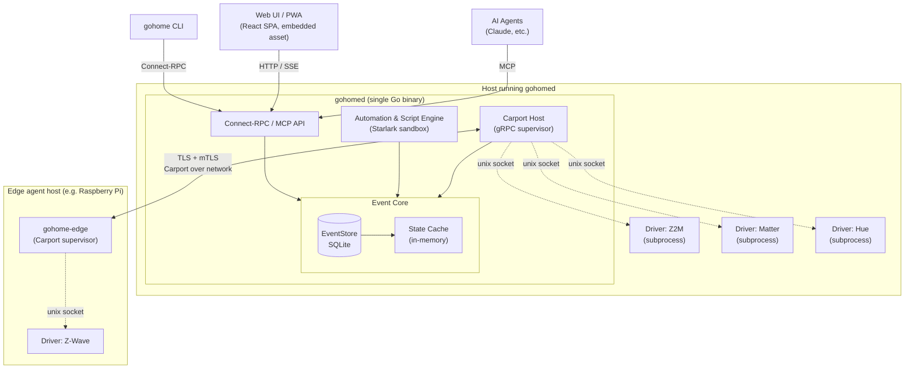

# gohome — Master Design Document

**Status:** Accepted (master design; pre-implementation)
**Date:** 2026-04-21
**Scope:** System-wide architecture and module boundaries for `gohome`, a Go-native home-automation platform.
**Successors:** 14 child design documents (see §10) will detail each module.

---

## Table of Contents

1. [Executive Summary](#1-executive-summary)
2. [Vision, Scope & Non-Goals](#2-vision-scope--non-goals)
3. [Architecture Overview & Component Inventory](#3-architecture-overview--component-inventory)
4. [Core Domain Model](#4-core-domain-model)
5. [Event-Sourced Runtime & Storage](#5-event-sourced-runtime--storage)
6. [Driver Plugin Architecture (Carport) + Configuration Languages](#6-driver-plugin-architecture-carport--configuration-languages)
7. [API Surface, Web UI, Auth & Policies](#7-api-surface-web-ui-auth--policies)
8. [Migration, Distribution & Operations](#8-migration-distribution--operations)
9. [Decision Record](#9-decision-record)
10. [Child Doc Roadmap](#10-child-doc-roadmap)
11. [Explicit Deferrals](#11-explicit-deferrals)

---

## 1. Executive Summary

**gohome** is a Go-native home-automation platform positioned as an opinionated replacement for Home Assistant for the prosumer / homelab audience. It leans into three architectural bets that distinguish it from Home Assistant as it exists today:

1. **Event sourcing as the architectural spine.** The event log is the source of truth; current state is a materialized view. This yields time-travel debugging, lossless history, free audit, and clean remote-agent replication — all from one design decision.
2. **Declarative config (Pkl) with sandboxed dynamic logic (Starlark).** No YAML+Jinja mush. Config is typed, git-versioned, AI-editable, and validated at load time. Logic is a real (if restricted) programming language, not a templating kludge.
3. **Agent-native from day one.** An MCP server is a first-class API surface, not a bolted-on integration. AI agents can inspect state, call services, edit Pkl config with validation feedback, and evaluate Starlark snippets — out of the box.

The system ships three binaries — `gohomed` (daemon), `gohome` (CLI), `gohome-edge` (optional remote driver host) — with a web UI embedded in `gohomed` as static assets. Drivers are separate artifacts that speak **Carport**, our gRPC-based driver protocol, over local subprocess sockets or TLS-over-TCP (for edge deployments).

Every decision in this document has been made with an eye toward a single quality: that a prosumer in 2026 — comfortable with a config file, running Docker or bare metal, with kids and guests on the home network, sometimes using an AI agent to manage things — can install gohome, import their HA setup, and feel that gohome is a meaningful upgrade in architecture, safety, and ergonomics.

---

## 2. Vision, Scope & Non-Goals

### 2.1 Target audience

Prosumer / homelab users. Comfortable editing a config file. Running Proxmox, Docker, or bare-metal Linux. Often with kids / family / guests on the home network. Some will manage via the UI, some via git-ops + CLI, some via AI agents.

### 2.2 Scope (v1.0)

- `gohomed` daemon, `gohome` CLI, embedded web UI.
- Carport driver plugin system (local subprocess + remote edge transports).
- Pkl for static/declarative config.
- Starlark for dynamic logic (automations, scripts, computed entities, widget compute).
- SQLite-backed event store with indefinite full-fidelity retention.
- Connect-RPC primary API + MCP server.
- Multi-user auth with passkeys-first, Pkl-declared policies.
- Home Assistant import tool.
- Static binary **and** OCI container distribution.
- A reference set of first-party core drivers: MQTT, Zigbee2MQTT bridge, Matter, HomeKit bridge, ESPHome native, Z-Wave JS bridge, generic REST, generic webhook, and one or two cloud integrations (Nest, Hue) as exemplars.

### 2.3 Explicit non-goals (not in v1.0)

- **High-availability clustering.** Single-primary only.
- **HA ongoing compatibility layer.** No HA-API shim so existing HA apps continue to work unmodified. Deferred pending real demand.
- **HA coexistence mode.** Running alongside a live HA instance during a transition. Deferred to v1.x.
- **Appliance OS image** (a gohomeOS analogous to HAOS).
- **Commercial plugin marketplace.** We ship a driver *directory* with signed manifests, not a store.
- **Voice-assistant deep integration.** Voice integrations are drivers or agents against our API.
- **Native mobile apps.** The web UI is a PWA; native wrappers are deferred.
- **Rollup / downsampling of event history.** v1.x feature.
- **WASM driver tier.** v1.x addition (the Carport schema leaves room).
- **Federation** (multi-primary setups that peer).

---

## 3. Architecture Overview & Component Inventory

### 3.1 Process & component map



### 3.2 Shipped binaries

| Binary | Purpose | Distribution |
|---|---|---|
| `gohomed` | The daemon. All long-running logic. Embeds the web UI. | Static Go binary, OCI image, `.deb`/`.rpm`, Homebrew formula |
| `gohome` | CLI for humans and agents. Thin Connect-RPC client. | Static Go binary |
| `gohome-edge` | Optional edge supervisor running on remote hosts. Hosts drivers, forwards Carport to primary. | Static Go binary, OCI image |

### 3.3 Internal modules (inside `gohomed`)

Each module has a narrow Go-package interface. Each is a candidate for its own child design document.

| Module | Responsibility |
|---|---|
| `eventstore` | Append-only event log, snapshots, replay, tailing. SQLite-backed. Sole gatekeeper of event data. |
| `state` | In-memory materialized view over the event log. Fast reads. Subscribes to the event stream. |
| `registry` | Device/entity/area/zone registry projection. SQLite tables populated from registry-affecting events. |
| `carport-host` | gRPC supervisor for local driver subprocesses and remote edge-agent connections. |
| `carport-proto` | Protobuf-defined Carport contract. Public, versioned (`v1alpha1`, `v1`). |
| `api` | Connect-RPC service implementations. |
| `mcp` | MCP server — thin shim over `api`. |
| `web` | Embedded static assets (React bundle) + HTTP mux. |
| `config` | Pkl loader, validator, diff-based reloader. Produces typed protobuf artifacts. |
| `automation` | Starlark sandbox + automation/script runtime. |
| `auth` | Users, roles, sessions, passkeys, API tokens, OIDC, policy enforcement. |
| `recorder` | Long-term retention: vacuum/checkpoint scheduling, optional TSDB sink stub, future rollup home. |
| `supervisord` | Main orchestrator: wires modules, handles startup/shutdown/reload. |

### 3.4 Externally distributed artifacts

| Artifact | What it is |
|---|---|
| Driver plugins | Carport-speaking gRPC servers. Binaries (local / edge) or WASM modules (future tier). |
| Pkl modules | Type definitions + helpers users import into their config. We ship `gohome.base`, `gohome.entities`, `gohome.automations`, etc. |
| Widget packs | React component bundles + Pkl widget class definitions. Loaded by the web UI at runtime. |

### 3.5 Public contracts (hardest things to change)

1. **Carport** — gRPC/protobuf. Between the Carport host and every driver. Same wire for local-subprocess, edge-over-TLS, and (future) WASM.
2. **Event schema** — protobuf messages persisted in the event log. Versioned, migration-aware.
3. **Connect-RPC API** — the user-facing RPC surface. Versioned under `gohome.v1.*`.
4. **MCP tool surface** — generated from the Connect-RPC surface plus hand-written wrappers for agent-ergonomic workflows.
5. **Pkl module schemas** — `gohome.*` Pkl modules users import. Semver-governed.

Everything else is an internal Go package boundary we can rearrange freely.

---

## 4. Core Domain Model

**Inspired by Home Assistant, reshaping the warts.** The vocabulary below is deliberately close to HA where muscle memory transfers, and deliberately diverges where HA's model has become confusing.

### 4.1 Primary nouns

**Driver** — *code*, not configuration. A Go binary (or WASM module, or edge process) that speaks Carport and knows how to talk to some kind of hardware or cloud system. E.g., `hue-driver`, `z2m-driver`, `matter-driver`.

**Driver instance** — *configuration*. A user-declared binding of a driver to specific parameters ("hue bridge at 10.0.0.42 with these credentials"). A user may run multiple instances of the same driver. This is the clean split HA lacks — HA collapses "code" and "configured instance" into "integration".

**Device** — a logical unit surfaced by a driver instance, usually corresponding to a physical thing or a cloud-side account resource. A single device belongs to exactly one driver instance.

**Entity** — an *addressable, typed property or capability* of a device. Every entity has:
- A unique id: `<domain>.<name>` (e.g., `light.kitchen`, `sensor.outdoor_temp`).
- A **typed** state (not always a string as in HA — `bool`, `int`, `float`, enum, struct, etc.).
- **Typed attributes** (not untyped dict blobs).
- **Capabilities** — the operations you can invoke on it.

**Entity class** — a reusable Pkl-declared *type* of entity: `gohome.entities.Light`, `gohome.entities.Thermostat`, etc. Custom classes are a first-class extension point.

**Computed entity** — promoted to first-class (HA's template entities were second-class). State defined by a Starlark expression over other entities' state; re-evaluated reactively.

```pkl
new ComputedEntity {
  id = "sensor.house_avg_temp"
  class = gohome.entities.Temperature
  compute = starlark"avg(s.state for s in entities(class='Temperature', area=areas.interior))"
}
```

**Area** — *spatial grouping inside the home*. Hierarchical: `living_room` is inside `main_floor`. Entities belong to zero-or-one area.

**Zone** — *geographic / geofence*. Defined by lat/lon + radius. Primarily used for presence-driven automations. Orthogonal to areas.

**Automation** — trigger → conditions → actions. Declared in Pkl by shape; triggers/conditions/actions carry Starlark where logic is required.

**Script** — a *callable* Starlark function registered under a name, optionally with typed parameters. Callable from automations, UI, CLI, MCP, other scripts.

**Scene** — a *declarative target state*. Applying a scene is a system-generated action; the diff against current state is computed, commands dispatched, a single `SceneApplied` event emitted.

**Dashboard** — a Pkl-declared layout of widget instances. Round-trips through the WYSIWYG editor.

**Widget** — a *class* of dashboard tile (Gauge, LineChart, EntityToggle, CameraStream, Markdown, ScriptButton). A widget class has a Pkl schema (props) and a React component (rendering).

**User, Role, Policy** — see §7.4.

### 4.2 Identity conventions

- Entities: `<domain>.<name>`.
- Devices: opaque ULID with a human-readable `slug` attribute.
- Driver instances: user-chosen slug.
- Areas / zones / users: slug.

Entity domains are a closed, versioned enum shipped with gohomed (`light`, `switch`, `sensor`, `binary_sensor`, `climate`, `cover`, `media_player`, `camera`, `lock`, `person`, `vacuum`, `fan`, `input_*`, …). Matches HA where muscle memory transfers; HA domains that have become archaic are omitted.

### 4.3 Capabilities replace "services"

HA's "services" are a global verb-space called against entity targets. gohome uses **capabilities**: typed methods on an entity discovered from its class.

```starlark
# inside an automation
light.kitchen.turn_on(brightness=40, transition=2s)
climate.upstairs.set_temp(target=68, mode="heat")
```

Under the hood: the runtime looks up the entity's class, finds the `turn_on` capability, type-checks arguments, emits a `CommandIssued` event. The owning driver receives the command on its Carport stream, acts, and emits `CommandAcknowledged` (or `CommandFailed`).

### 4.4 HA warts explicitly reshaped

| HA wart | gohome fix |
|---|---|
| "Integration" means both code and config | Split: **driver** (code) + **driver instance** (config) |
| Entity state is always a string | Typed state via entity class |
| Attributes are untyped dicts | Typed attributes via entity class |
| Services are a weird global verb-space | Capabilities — methods on entity classes |
| Template entities feel second-class | Computed entities are first-class, Starlark-backed |
| Jinja lives in YAML | Pkl holds Starlark snippets with typed wrappers |
| Areas are floppy, zones are a bolted-on feature | Both are first-class geometry primitives |
| Entity ids are free-form | Still `domain.name`, but domain is a closed versioned enum |

### 4.5 HA concepts kept verbatim

Entity domains, entity id format, areas, scenes, scripts, automation trigger/condition/action shape, persons, zones as geofences, state + attributes terminology.

---

## 5. Event-Sourced Runtime & Storage

### 5.1 Event types

Events are protobuf messages living in `proto/gohome/events/v1/*.proto`. The envelope:

```proto
message Event {
  uint64 position = 1;      // monotonic, assigned by eventstore on append
  google.protobuf.Timestamp ts = 2;
  string source = 3;        // "driver:hue_main", "user:fdatoo", "automation:battery_warmer", "system"
  Payload payload = 4;
}

message Payload {
  oneof kind {
    StateChanged state_changed = 1;
    CommandIssued command_issued = 2;
    CommandAcknowledged command_acked = 3;
    CommandFailed command_failed = 4;
    EntityRegistered entity_registered = 5;
    EntityUnregistered entity_unregistered = 6;
    DriverEvent driver_event = 7;
    SceneApplied scene_applied = 8;
    AutomationTriggered automation_triggered = 9;
    AutomationFinished automation_finished = 10;
    AuthEvent auth_event = 11;
    ConfigApplied config_applied = 12;
    SystemEvent system_event = 99;
  }
}
```

Key commitments:

- **Events are the only way state changes.** No module writes current state directly. It writes a `StateChanged` event; the state cache updates as a consequence.
- **Commands are also events.** An audit log of intent *and* result. "Did my midnight lights-off actually reach every light?" is answerable.
- **Driver-specific events are typed per driver class.** `DriverEvent` payloads carry a class tag and an opaque typed protobuf; the driver's Pkl manifest tells the runtime how to interpret it.

### 5.2 EventStore semantics

The `eventstore` package is the sole gatekeeper of event data.

- **Append-only.** No UPDATE, no DELETE except by retention (§5.7).
- **Monotonic positions.** `position` is strictly increasing; it's the cursor for subscriptions.
- **Durable by default.** Every append is a SQLite transaction in WAL mode, fsync'd before return.
- **Single-writer in-process.** Writes go through a single goroutine that owns the write lock. Reads are concurrent via WAL's MVCC.
- **Narrow interface:** `Append`, `Read(from, to, filter) -> iterator`, `Subscribe(from, filter) -> channel`, `LatestPosition`. Nothing else reaches into SQLite for events.

### 5.3 Materialized state cache

- **In-memory**, protected by a RWMutex (`sync.Map` an acceptable alternative; decided at implementation time).
- **Eventually consistent with the event log.** A goroutine tails `eventstore.Subscribe()` and applies events.
- **Read path is non-blocking.** `state.Get("light.kitchen")` is a map lookup.
- **Write path is through events.** Setters append events; the tailer updates the map.
- **Recovery on startup.** Load most recent snapshot, fast-forward by replaying events since the snapshot's position.

### 5.4 Registry as a second projection

Registry tables (`devices`, `entities`, `areas`, `zones`, `driver_instances`, `users`, `roles`, `policies`, …) are a second materialized view of the event log — populated by applying registry-affecting events, and rebuildable on startup.

Reasoning: the API layer joins and filters registry data frequently; a SQL projection is more useful than keeping it purely in memory.

### 5.5 Snapshots

- **Periodic.** Every N events or M minutes, whichever comes first (configurable defaults: 10k events, 1h).
- **Compact.** Protobuf-encoded, zstd-compressed.
- **Fast startup.** Load latest snapshot, replay from `snapshot.position` forward.
- **Time-travel basis.** For any target position, find the nearest preceding snapshot, load, replay to target. Exposed as `gohome events replay --at <timestamp>` and an MCP tool.

### 5.6 Unified subscription model

All consumers use the same primitive:

```go
sub := eventstore.Subscribe(ctx, SubscribeRequest{
    FromPosition: cursor,
    Filter:       Filter{Kinds: []string{"state_changed"}},
    Durable:      true,   // persist cursor in `subscriptions` table
})
for ev := range sub.C() {
    handle(ev)
    sub.Ack(ev.Position) // idempotent
}
```

| Consumer | Durable? | Filter |
|---|---|---|
| State cache | No (rebuilt from snapshot+replay on start) | All |
| Registry projector | No (same) | Registry-affecting only |
| Automation engine | Yes | Configurable per-automation |
| Recorder (retention / future rollups) | Yes | All |
| UI WebSocket / SSE | No, per-client position | Client-specified |
| MCP `tail_events` | No, per-agent position | Agent-specified |
| Edge-agent replication | Yes, per-agent cursor | All |

**One primitive, many uses** — the key payoff of event sourcing.

### 5.7 Retention

**Indefinite full-fidelity by default.**

- No automatic deletion.
- The `recorder` goroutine handles SQLite maintenance: periodic `PRAGMA wal_checkpoint(TRUNCATE)`, `VACUUM` schedule, integrity checks.
- Users may configure retention in Pkl (`maxAgeDays`, `maxBytes`, per-kind overrides). Default: unset.
- **Rollups** — periodic aggregation of high-frequency numeric events into lower-frequency summaries — are a v1.x feature, deferred to a child doc. Event schema leaves room (`RollupApplied` event).

Disk cost at expected prosumer scale (200 entities @ 30s cadence avg, ~200 B/event): ≈40 GB/year. Fine on a NAS for a decade. Heavy power-monitoring deployments may reach 100-500 GB/year, still manageable. If/when a user exceeds this, opt-in rollups or an external TSDB sink driver are the escape hatches.

### 5.8 SQLite schema (sketch; details in child doc C1)

```sql
CREATE TABLE events (
  position INTEGER PRIMARY KEY AUTOINCREMENT,
  ts       INTEGER NOT NULL,
  kind     TEXT NOT NULL,
  entity   TEXT,
  source   TEXT NOT NULL,
  payload  BLOB NOT NULL            -- protobuf-encoded Event
);
CREATE INDEX events_ts         ON events(ts);
CREATE INDEX events_entity_ts  ON events(entity, ts);
CREATE INDEX events_kind_ts    ON events(kind, ts);

CREATE TABLE snapshots (
  position INTEGER PRIMARY KEY,
  ts       INTEGER NOT NULL,
  state    BLOB NOT NULL             -- zstd(protobuf)
);

-- Registry, auth, subscriptions tables live alongside; schemas in child doc C1.
```

**The `eventstore` package is the ONLY module that touches these tables for events.** Every other module uses the `eventstore` interface. This discipline is what keeps us free to swap the backend if we ever need to.

### 5.9 Concurrency invariants

1. **Single writer per stream.** Only `eventstore.Append` writes to `events`.
2. **Monotonic position is authoritative.** Cursors, subscriptions, and snapshots all reference positions.
3. **State cache is a lagging mirror, never the truth.** If cache and log disagree, the log wins; cache is discarded and re-hydrated.

These three invariants, enforced in code, are what keep event-sourcing from becoming a distributed-systems problem.

---

## 6. Driver Plugin Architecture (Carport) + Configuration Languages

Two tightly-coupled subsystems that together form the extensibility spine of gohome.

### 6.1 Carport — the driver protocol

**Wire:** gRPC, protobuf-defined. Package: `gohome.carport.v1alpha1`, graduating to `v1` when we commit to backward-compat promises.

```proto
service Driver {
  rpc Handshake(HandshakeRequest) returns (HandshakeResponse);
  rpc RegisterInstance(RegisterRequest) returns (RegisterResponse);
  rpc Commands(stream Command) returns (stream CommandResult);   // bidi
  rpc Events(EventsRequest) returns (stream DriverEvent);        // server-streaming
  rpc Health(HealthRequest) returns (HealthResponse);
  rpc Shutdown(ShutdownRequest) returns (ShutdownResponse);
}
```

- **Handshake** — driver advertises capabilities, protocol version, and returns its Pkl manifest *inline* (embedded in the binary as a resource). Version lockstep is guaranteed without an out-of-band file.
- **RegisterInstance** — for each configured driver instance, gohomed sends the instance's typed config blob; the driver returns the initial registry delta and begins streaming events.
- **Commands stream** — gohomed sends `Command`; driver acks asynchronously via `CommandResult`. `command_id` correlates; the event log records `CommandIssued`, then `CommandAcknowledged` or `CommandFailed`.
- **Events stream** — drivers push `DriverEvent`s; most are translated to `StateChanged`, driver-specific events pass through typed.

### 6.2 Transports

Same gRPC surface, different wires:

| Mode | When | Transport | Auth |
|---|---|---|---|
| Local subprocess | Default, same host | Unix domain socket | Shared handshake secret via env var |
| Remote (edge) | Edge-agent deployments | TLS over TCP | mTLS, CA issued by gohomed at pairing |
| WASM (deferred) | Cloud API drivers, v1.x | wazero host-function bridge | In-process, sandboxed at host level |

`carport-host` dials local subprocesses; for edge, it maintains a long-lived TLS connection (the edge agent dials in, inverting the client/server direction at the transport layer while keeping the gRPC semantics unchanged).

### 6.3 Driver lifecycle

Managed by `carport-host`:

1. **Launch** — fork the driver binary with `GOHOME_CARPORT_SOCKET=...`, `GOHOME_CARPORT_SECRET=...`. For edge: maintain the TLS listener.
2. **Handshake** — verify protocol version and capabilities; load returned Pkl manifest.
3. **Register instances** — for each configured instance, call `RegisterInstance`.
4. **Run** — events in, commands out.
5. **Health probes** — periodic `Health` calls; failure → restart.
6. **Graceful shutdown** — on daemon shutdown or instance removal.
7. **Crash** — subprocess death caught; `SystemEvent{kind: driver_crashed}` emitted; restarted with exponential backoff; registry reconciled on reconnect.

**Drivers are stateless from gohomed's perspective.** Authoritative state is in the event log and registry projection.

### 6.4 Driver manifest

Each driver ships a Pkl module embedded in the binary, returned inline on `Handshake`:

```pkl
module gohome.drivers.hue
import "gohome/carport.pkl" as carport

manifest: carport.DriverManifest = new {
  name = "hue"
  version = "1.2.0"
  protocol = "v1alpha1"
  instanceConfig = HueConfig
  produces = List(
    gohome.entities.Light,
    gohome.entities.MotionSensor,
    gohome.entities.Button,
  )
  driverEventTypes = List(HueButtonPressed)
}

class HueConfig {
  bridgeAddress: String(isIpOrHostname())
  apiKey: String(length > 10)
  pollIntervalSeconds: Int(isBetween(5, 300)) = 30
}
```

Users importing the module get full typed config:

```pkl
import "gohome/drivers/hue.pkl" as hue

drivers = new Mapping<String, DriverInstance> {
  ["hue_main"] = new hue.Instance {
    bridgeAddress = "10.0.0.42"
    apiKey = read("env:HUE_API_KEY")
    pollIntervalSeconds = 15
  }
}
```

Invalid config fails at `gohome config validate` time — before the daemon touches the network.

### 6.5 User config layout

```
gohome/
├── main.pkl                   # root module — imports the rest
├── drivers.pkl                # driver instances
├── areas.pkl                  # areas + hierarchy
├── zones.pkl                  # geofences
├── entities/
│   ├── computed.pkl
│   └── overrides.pkl
├── automations/
│   ├── lighting.pkl
│   ├── climate.pkl
│   └── handlers/
│       ├── evening.star
│       └── morning.star
├── scripts/
│   └── *.star
├── scenes.pkl
├── dashboards/
│   ├── default.pkl
│   └── mobile.pkl
├── auth/
│   ├── users.pkl
│   ├── roles.pkl
│   └── policies.pkl
└── secrets.pkl
```

### 6.6 `gohome.*` Pkl modules

| Module | Provides |
|---|---|
| `gohome.base` | Root types, utility functions, secret source interfaces |
| `gohome.carport` | `DriverManifest`, typed config base classes |
| `gohome.entities` | Standard entity classes |
| `gohome.automations` | `Automation`, `Trigger`, `Condition`, `Action`, typed Starlark wrappers |
| `gohome.dashboards` | `Dashboard`, `Page`, `Grid`, `WidgetInstance` |
| `gohome.widgets` | Standard widget class definitions |
| `gohome.auth` | `User`, `Role`, `Policy` classes |
| `gohome.starlark` | `StarlarkExpr`, `StarlarkScript`, `StarlarkCondition`, `Starlark` typed wrappers with validation hooks |

### 6.7 Config evaluation & reload

On startup and `gohome config apply`:

1. Evaluate `main.pkl` via the Pkl evaluator.
2. Pkl produces a typed protobuf `ConfigSnapshot` or fails with rich errors.
3. `config.Compile()` validates cross-references (entity references resolve, driver classes import, Starlark parses).
4. **Diff-based reload.** Compare new snapshot to applied snapshot. Compute the minimal set of side-effects — which driver instances to register/unregister, which automations to recompile, which dashboards to update. Unchanged driver instances are untouched.
5. Apply the diff.
6. Emit `ConfigApplied` event with diff metadata.

`gohome config apply --dry-run` emits the planned diff without applying.

### 6.8 Starlark runtime

**Engine:** `go.starlark.net` (Google-maintained canonical Go Starlark).

Execution contexts with scoped stdlibs:

| Context | Stdlib |
|---|---|
| Automation handler | `state`, `call_service`, `sleep`, `now`, `log`, `notify`, `scene.apply`, `event.fire`, `random`, `time` |
| Computed entity | `state` (read-only), `now` — pure, side-effect-free |
| Trigger condition | `state`, `event`, `now` — pure, bounded time |
| Script | Same as automation + typed parameters |
| Widget compute | `state` (read-only), cached |
| MCP `eval_starlark` | Scratch, configurable scope, readonly by default |

Resource limits per execution: wall-clock budget (30s / 100ms / 50ms default by context), step counter, memory cap. On breach, execution is cancelled and a corresponding `AutomationFinished` or equivalent event is emitted.

**No unrestricted I/O.** All I/O is mediated by the stdlib, which routes through gohomed internals — logged, policy-checked.

**User-defined Starlark modules** — `load("//lib/helpers.star", "compute_temp")` is supported for shared logic under the config dir. No external filesystem or network access from user Starlark.

### 6.9 Pkl ↔ Starlark interop (the seam)

`gohome.starlark` provides typed wrappers:

```pkl
typealias StarlarkExpr      = String(isValidStarlarkExpr())
typealias StarlarkScript    = String(isValidStarlarkScript())
typealias StarlarkCondition = String(isValidStarlarkCondition())
```

Strings at runtime, but the validators invoke a Starlark parser at compile time. Authors get syntax and scope errors at `config validate`, not at automation-firing time.

**Convention:** anything longer than ~one line migrates to a `.star` file referenced by path. Pkl holds structure plus one-liners; `.star` files hold bodies.

### 6.10 Secrets

Never in Pkl source. `gohome.base.Secret` is an interface with implementations:

- `env:` — environment variables.
- `file:` — file contents.
- `keyring:` — system keyring.
- `vault:`, `1password:`, `bitwarden:` — community Pkl modules, later.

Secrets resolve at runtime, never at artifact-compile time. Compiled artifacts never contain secret values.

---

## 7. API Surface, Web UI, Auth & Policies

### 7.1 Connect-RPC service surface

Services under `gohome.v1.*`. Initial inventory:

| Service | Key RPCs |
|---|---|
| `EntityService` | `List`, `Get`, `CallCapability`, `Subscribe` (stream) |
| `DeviceService` | `List`, `Get`, `Rename`, `Reassign` |
| `AreaService` | `List`, `Get` |
| `ZoneService` | `List`, `Get` |
| `DriverService` | `ListDrivers`, `ListInstances`, `InstanceHealth`, `RestartInstance` |
| `EventService` | `Query`, `Tail` (stream), `ReplayAt` |
| `SceneService` | `List`, `Apply`, `Preview` |
| `AutomationService` | `List`, `Get`, `Enable`, `Disable`, `Trigger` |
| `ScriptService` | `List`, `Run`, `Cancel` |
| `ConfigService` | `Validate`, `Apply` (dry-run + real), `Reload`, `GetArtifact` |
| `DashboardService` | `List`, `Get`, `SaveLayout` (WYSIWYG write-back) |
| `AuthService` | `Login`, `Logout`, `CurrentUser`, `CreateToken`, `RevokeToken`, `ListUsers`, `RegisterPasskey`, `StartWebAuthnChallenge` |
| `SystemService` | `Version`, `Health`, `Metrics`, `Diagnostics` |

**Streaming** — Connect-RPC server-streaming over HTTP/2; browsers receive via SSE-compatible transport.

**Generated clients** — Buf generates Go (CLI), TypeScript (web UI), and Python (`gohome-client` on PyPI for agents, scripts, third-party tools).

IDL lives in `proto/gohome/v1/*.proto`, published as a git-tagged schema package.

### 7.2 MCP server

Thin shim on the Connect-RPC surface. Runs in-process; exposed over MCP's stdio or HTTP transport.

**v1 tool inventory:**

| Tool | Maps to | Purpose |
|---|---|---|
| `gohome__get_state` | `EntityService.Get` | Read current state |
| `gohome__list_entities` | `EntityService.List` | Browse with filters |
| `gohome__call_capability` | `EntityService.CallCapability` | Act |
| `gohome__query_events` | `EventService.Query` | Historical reads |
| `gohome__tail_events` | `EventService.Tail` | Live stream |
| `gohome__apply_scene` | `SceneService.Apply` | Aggregate action |
| `gohome__run_script` | `ScriptService.Run` | Named script invocation |
| `gohome__validate_config` | `ConfigService.Validate` | Check a proposed Pkl change |
| `gohome__apply_config` | `ConfigService.Apply` | Persist a Pkl change (policy-gated) |
| `gohome__eval_starlark` | In-process Starlark scratch | Ad-hoc computation |
| `gohome__read_config_file` / `gohome__write_config_file` | Filesystem under config dir | Targeted file edits |

Tool schemas are generated from protobuf types — as precise as our IDL.

**Auth:** MCP tokens are regular API tokens, bound to a user, scoped by policy. An agent token limited to `gohome__run_script` on a whitelist is trivial to issue.

### 7.3 Web UI

**Stack:** React 19 + Vite + TypeScript + Tailwind + shadcn/ui + Radix primitives + Framer Motion + TanStack Query + TanStack Router + Connect-ES generated client.

**Distribution:** Embedded static assets inside the gohomed binary (`embed.FS`). One binary, one port, no Node in production. Development mode runs Vite separately for HMR.

**Top-level routes:**

- `/` — default dashboard
- `/dashboards/:slug` — named dashboards
- `/entities`, `/entities/:id` — entity browser + detail
- `/devices`, `/devices/:id` — device view
- `/areas`, `/zones`
- `/automations`, `/automations/:slug`
- `/scripts`, `/scripts/:slug`
- `/events` — log explorer with filter + CSV export + "replay to this point"
- `/config` — Monaco-based Pkl + Starlark editor with LSP, validate, diff preview, apply
- `/drivers` — driver instances, health, logs, install/remove
- `/auth` — users, roles, tokens, passkey registration
- `/settings`

**Data layer:**

- **Server state:** TanStack Query + Connect-ES. Typed end-to-end.
- **Live data:** a single long-lived `EventService.Tail` stream multiplexed client-side; components subscribe via Zustand selectors. One connection, many consumers.
- **Client state:** Zustand for UI-only.

**Dashboard subsystem (Pkl round-trip):**

- `DashboardService.Get` returns the evaluated Pkl AST.
- UI renders a `react-grid-layout` grid with widget instances.
- **Edit mode:** drag / drop / resize / add / remove widgets; changes tracked as local editing state.
- **Save:** the edited layout is serialized *back to Pkl source* at the AST level (hand-edited Starlark inside widgets is preserved). Server re-validates, commits to `dashboards/<slug>.pkl`, emits `ConfigApplied`.

**Widget registry:**

- Built-in widgets are part of the gohomed embedded bundle.
- Community widget packs install as **two artifacts**: JS bundle + Pkl module — mirroring Carport's "binary + manifest" pattern.
- Widget bundles are signed; signatures verified at install time.

**Theming:** shadcn/ui + custom gohome palette / typography. Light, dark, system-auto. PWA-installable. Mobile-first dashboard reflow below 640px.

### 7.4 Auth & policies

**Users** — Pkl-declared. Fields: slug, display name, auth methods (passkey credential ids, password hash, OIDC subject), role assignments, active flag.

**Auth methods:**

- **Passkeys (WebAuthn)** — primary. Registered via UI or CLI.
- **Password** — fallback. Argon2id. Can be disabled globally.
- **OIDC** — opt-in integration (`auth.oidc.pkl`). Subject → user mapping. For Authentik / Authelia users.
- **API tokens** — long-lived, scoped, revocable, hashed at rest.

**Sessions** — HTTP-only, Secure, SameSite=Strict cookies; short-lived access + rotating refresh with server-side state.

**Roles** — Pkl-declared. Built-in: `admin`, `member`, `guest`. Custom roles are just Pkl instances.

**Policies** — Pkl-declared, compiled to a policy artifact, enforced at the API boundary:

```pkl
policies = List(
  new Policy {
    name = "kids_can_control_bedrooms_only"
    subjects = List(roles.kids)
    allow = new CapabilityAllow {
      capabilities = List("turn_on", "turn_off", "set_brightness")
      targets = new EntitySelector {
        areas = List(areas.kid_bedrooms)
      }
    }
    deny = new CapabilityDeny {
      capabilities = List("*")
      targets = new EntitySelector {
        classes = List(entities.Lock, entities.Alarm)
      }
    }
  },
)
```

**Enforcement points:**

1. Every Connect-RPC handler starts with `auth.Authenticate(ctx)`.
2. Mutating calls go through `auth.Authorize(ctx, action, target)`.
3. Subscription streams filter events per-user based on policy (guests never see events for areas they lack access to).
4. MCP tool calls inherit the token's user — no special agent bypass.

**Auth events on the event log:** `AuthEvent{kind: login_succeeded, user, source_ip, auth_method}`, `AuthEvent{kind: policy_denied, user, action, target, reason}`, etc. Free audit log.

### 7.5 End-to-end user journey (illustrative)

1. User asks Claude: *"Set up an automation that turns on my garage lights when my car arrives home after sunset."*
2. Claude's MCP client discovers `gohome__*` tools.
3. Claude calls `gohome__list_entities` filtering for `device_tracker` and `light`, finds `device_tracker.model_y` and `light.garage`.
4. Claude drafts an automation Pkl snippet; calls `gohome__validate_config`. Daemon returns: *"Valid. Diff: +1 automation: `garage_arrival_lights`."*
5. Claude presents the diff; on user approval, calls `gohome__apply_config`.
6. `ConfigApplied` event. Automation engine compiles and registers the new handler. UI reflects the change. Audit log records the user and the token that made it.

Every decision above was made to make this workflow natural.

---

## 8. Migration, Distribution & Operations

### 8.1 HA import tool — `gohome import-ha`

A subcommand that reads a Home Assistant config directory and produces a gohome Pkl config tree.

| HA construct | gohome target | Confidence |
|---|---|---|
| `configuration.yaml` core settings | `main.pkl`, `gohome.settings.pkl` | High |
| Area & zone registries | `areas.pkl`, `zones.pkl` | High |
| Device & entity registries | `entities/overrides.pkl` | High |
| Known integrations → drivers | Per integration | Varies |
| `automations.yaml` / UI automations | `automations/*.pkl` + `.star` | Medium |
| `scripts.yaml` | `scripts/*.pkl` + `.star` | Medium |
| `scenes.yaml` | `scenes.pkl` | High |
| Template sensors (config) | `entities/computed.pkl` | Medium |
| Lovelace YAML dashboards | `dashboards/*.pkl` | Medium — common cards translate; custom cards marked TODO |
| Users, persons | `auth/users.pkl` | Passwords not migrated — passkey re-registration required |
| `secrets.yaml` | `secrets.pkl` wrappers | High — source hints preserved, values not copied |

**v1.0 integration coverage:** MQTT, Zigbee2MQTT, ESPHome, HomeKit, Matter, Hue, Nest, Z-Wave JS, generic REST, generic webhook, and HA's `template` platform (mapped to `ComputedEntity`). Aligns with the shipped driver set from §2.2; `template` is an HA-import concept, not a driver. Other integrations produce `# TODO: integration '<name>' not yet mapped` stubs.

**Jinja → Starlark:** rule-based transpiler covers common patterns (`states('x')` → `state('x')`, arithmetic, control flow, common filters). Unhandled constructs emit `starlark"# FIXME: unmapped Jinja: <original>"` with a searchable diagnostic.

**Output is a git-initable directory.** `gohome import-ha ~/.homeassistant -o ./my-gohome` produces a tree the user can version and review before pointing gohomed at it.

**Explicit non-goals of the importer:** recorder DB migration, HACS integrations, supervisor add-ons.

### 8.2 Distribution artifacts (per release)

| Artifact | Platforms |
|---|---|
| `gohomed` static binary | linux/amd64, linux/arm64, linux/armv7, darwin/arm64, darwin/amd64, windows/amd64 |
| `gohome` static binary | Same matrix |
| `gohome-edge` static binary | Linux matrix |
| `ghcr.io/gohome/gohomed:<version>` OCI image | linux/amd64, linux/arm64 |
| `ghcr.io/gohome/gohome-edge:<version>` OCI image | linux/amd64, linux/arm64 |
| `.deb` / `.rpm` packages | linux/amd64, linux/arm64 |
| Homebrew formula | darwin/* |
| systemd unit template | Bundled in packages + `contrib/` |

First-party driver binaries ship as separate artifacts under `ghcr.io/gohome/driver-<name>:<version>`. Drivers are installed explicitly, not magically.

Checksums + sigstore signatures on every artifact. `RELEASE.yaml` manifests list hashes and driver-compatibility matrix.

### 8.3 Updates

**gohomed itself:**

- OCI users: update the tag. Standard.
- Bare metal: `apt`, `brew`, or `gohome self-update` (downloads binary, verifies signature, atomically replaces, restarts via systemd).
- No unattended auto-update by default. Opt-in cron trigger exists.

**Schema migrations:** `meta` table tracks version; golang-migrate scripts run at startup; automatic pre-migration DB copy. Only-forward, never destructive.

**Event schema:** old events remain valid forever. New kinds are additive. Unknown kinds logged and skipped by projections that don't understand them.

**Pkl module versions:** gohomed pins a minimum supported version; config validated at load with clear errors if out-of-date.

**Driver updates:** drivers version independently. Each driver advertises its Carport version on handshake. `gohomed` refuses handshake outside its compatible range. `gohome driver upgrade <name>` is per-instance; no daemon restart.

### 8.4 Backups

**Total persistent state:** config directory (Pkl) + SQLite DB + driver binaries.

- Config: git (documented happy path). Optional `gohome config auto-commit` on `ConfigApplied`.
- SQLite: `gohome backup` uses SQLite online backup API; consistent, no downtime; optional user-key encryption.
- Drivers: reinstallable from release artifacts.

Moving to a new server: `scp` the backup, install gohomed, `gohome restore`. Documented as a one-liner.

### 8.5 Observability

Exposed via `SystemService`:

- **Structured logs** — stdlib `slog`, JSON by default, configurable level.
- **Metrics** — Prometheus-compatible `/metrics`. Runtime metrics + gohome counters (events appended, commands by entity, driver restarts, automations fired, API latency).
- **Tracing** — OpenTelemetry with optional OTLP exporter. Cross-module trace: API call → event append → state update → driver dispatch.
- **Diagnostics bundle** — `gohome diag` produces a redacted support bundle: versions, driver versions, recent errors, health snapshots. Safe to share.

---

## 9. Decision Record

Every numbered decision made during the design session, preserved for future readers:

| # | Decision | Alternatives considered | Reason |
|---|---|---|---|
| 1 | **Prosumer HA replacement** as the target audience | Personal homelab / Growth-path / Reinvent | Ambition level, ecosystem breadth, migration matters |
| 2 | **HA-inspired vocabulary, reshape warts** | Mirror verbatim / Reinvent from scratch | Muscle memory transfers where it helps; confused concepts fixed |
| 3 | **Single primary + optional edge agents** | Single-host-only / HA cluster | Real use cases for remote radios; clustering is a niche tar pit |
| 4 | **Hybrid gRPC Carport contract** (local subprocess / remote / WASM later) | Pure go-plugin / WASM-first / In-process only | Subprocess isolation + remote as a transport concern + WASM as a future tier |
| 5 | **Pkl + embedded Starlark snippets with typed wrappers** | Hard split / Starlark-heavy | Pragmatic seam; validation at compile time; big logic in `.star` files |
| 6 | **Event-sourced core + indefinite full-fidelity retention** | HA-classic state store / DB-backed / Short retention with rollups | Time-travel, audit, remote-agent replication, uniform subscription model |
| 7 | **SQLite for everything** | BadgerDB+SQLite / TSDB+SQLite / NATS JetStream+SQLite | `eventstore` interface gives us an escape hatch; SQL debugging is too valuable to surrender |
| 8 | **Connect-RPC + MCP from day one** | REST/WebSocket / gRPC+gateway / JSON-RPC | Protobuf is already our lingua franca; browsers and curl both work; MCP is 2026-table-stakes |
| 9 | **React + shadcn/ui + Tailwind + Vite**, Pkl-declared dashboards, embedded | SvelteKit / SolidJS / htmx+templ | "Beautiful" is solved in React; `react-grid-layout` is the mature primitive; contributor pool |
| 10 | **Multi-user, Pkl-declared policies, passkeys-first, OIDC opt-in** | Trust-the-LAN / Single-user-tokens / Passkey-only | Families and guests are real; passkeys are the 2026 default; OIDC for homelab SSO |
| 11a | **HA importer at v1.0; coexistence deferred; ongoing-compat deferred** | Import-only / Import+coexistence / Import+compat | Earns migration credibility without committing to tracking HA's API forever |
| 11b | **Static binary + OCI container at v1.0; appliance OS deferred** | Binary-only / Container-first / Container + appliance | Serves both bare-metal homelab and Docker/Portainer/Unraid users from day one |
| Name | **Carport** as the driver protocol name | — | Metaphor: drivers are parked adjacent to the house |

---

## 10. Child Doc Roadmap

This master document covers the forest. Each child document covers a tree. Proposed writing / implementation order:

| # | Child doc | Covers |
|---|---|---|
| C1 | **Event Core & Storage** | `eventstore`, `state`, `registry`, snapshots, SQLite schema, migrations, concurrency invariants, replay |
| C2 | **Carport Protocol v1** | Full protobuf defs, handshake semantics, lifecycle state machine, error taxonomy, transports, mTLS pairing |
| C3 | **Driver SDK (Go)** | Reference Go library for driver authors: entity class registration, event emission, command handlers, test harness, example driver |
| C4 | **Pkl Schema & Config Lifecycle** | All `gohome.*` Pkl modules, evaluator pipeline, diff-based reload, secret sources, validators, LSP integration |
| C5 | **Starlark Runtime** | Per-context stdlib, resource limits, user-defined `load()`, Pkl ↔ Starlark bridging, debugging (`gohome eval`), test harness |
| C6 | **Automation & Script Engine** | Compiler from Pkl to runtime objects, trigger matching, condition evaluation, action dispatch, history + debugging |
| C7 | **Connect-RPC API** | Full `.proto` files for `gohome.v1.*`, service semantics, error taxonomy, pagination, streaming, versioning policy |
| C8 | **MCP Server** | Tool inventory, schema generation, auth/policy binding, streaming tools, agent-safety guardrails for `eval_starlark` |
| C9 | **Auth & Policy** | Session model, passkey flow, OIDC integration, token management, policy compilation + enforcement points, audit |
| C10 | **Web UI Architecture** | Routing, data layer, live-stream multiplexer, dashboard editor, widget registry, widget pack format, theming, PWA |
| C11 | **HA Import Tool** | Per-integration mapping, Jinja→Starlark transpiler rules, failure modes, diagnostic output format |
| C12 | **Edge Agent (`gohome-edge`)** | Pairing flow, connection resilience, local event buffering, offline-mode failover, multi-edge scenarios |
| C13 | **Distribution, Updates & Operations** | Release engineering, signing, schema migrations, backup/restore, self-update, diagnostics bundle |
| C14 | **Rollup & Long-Term Retention** (v1.x) | Downsampling design, rollup event kinds, TSDB sink driver |

Some are small; some are substantial. They can be written, reviewed, and implemented largely independently — matching the shape of a project of this scope.

---

## 11. Explicit Deferrals

Named here so the design doc acknowledges them without blocking:

- **High-availability clustering** — deferred indefinitely.
- **Native mobile apps** — PWA is v1; native wrappers are out of scope.
- **Voice assistant deep integration** — treated as drivers or agents against our API.
- **WASM driver tier** — v1.x (Carport schema leaves room).
- **HA ongoing API compatibility layer** — deferred pending real demand.
- **Appliance OS image** — deferred.
- **Commercial marketplace** — indefinitely deferred; we ship a directory.
- **Rollup / downsampling** — v1.x feature (child doc C14).
- **Federation** (multi-primary peering) — not in roadmap.

---

*End of master design document.*
