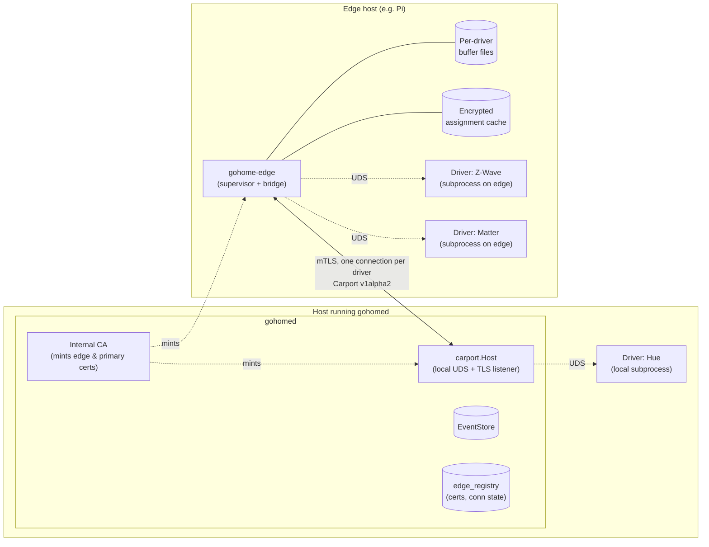

# C12 — Edge Agent (`gohome-edge`) Design

**Parent:** [gohome Master Design](./2026-04-21-gohome-master-design.md)
**Date:** 2026-04-27
**Status:** Draft
**Depends on:** C2 (Carport wire — `Run` stream is transport-agnostic; `v1alpha2` hook reserved), C4 (Pkl module shapes for `EdgeAgent`), C7 (Connect-RPC `EdgeService` surface), C9 (auth — enrollment-token + CA primitives reused), C13 (release engineering for the new binary; no inline coupling).
**Closes:** the master design's §3.2 promise of `gohome-edge` as a shipped binary, and §3.1's "edge-agent host" topology.

---

## Table of Contents

1. [Scope](#1-scope)
2. [Background](#2-background)
3. [Architecture Overview](#3-architecture-overview)
4. [Repo & Binary Layout](#4-repo--binary-layout)
5. [Pairing & Identity](#5-pairing--identity)
6. [Connection Model](#6-connection-model)
7. [Data Flow](#7-data-flow)
8. [Buffering](#8-buffering)
9. [Boot-Offline & Assignment Cache](#9-boot-offline--assignment-cache)
10. [Wire Additions (`v1alpha2`)](#10-wire-additions-v1alpha2)
11. [Failure Modes](#11-failure-modes)
12. [Observability](#12-observability)
13. [Security Model](#13-security-model)
14. [CLI Surface](#14-cli-surface)
15. [Testing Strategy](#15-testing-strategy)
16. [Implementation Order](#16-implementation-order)
17. [Decision Record](#17-decision-record)
18. [Explicit Deferrals](#18-explicit-deferrals)

---

## 1. Scope

C12 ships `gohome-edge`, an optional supervisor binary that hosts Carport drivers on remote hosts (e.g. a Raspberry Pi co-located with a Z-Wave radio) and proxies their `Run` streams to a primary `gohomed` over mTLS. The edge is a **slim relay**: it spawns and supervises driver subprocesses, transparently bridges their gRPC `Run` streams up to the primary, and buffers events to disk during transient WAN outages. **No automation logic, no event core, no command authority lives on the edge** — it is a transport bridge with persistence for outage tolerance.

After C12, an operator can declare an `EdgeAgent { slug = "pi-basement"; drivers = [...] }` in Pkl on the primary, run a one-command pairing flow, and have drivers on the edge participate in the system identically to drivers on the primary host — with graceful degradation during connectivity loss.

### 1.1 In scope

- **`gohome-edge` binary** — single static Go binary, hosted in a new sibling repo (§4). Subcommands: `pair`, `run` (default), `status`, `rotate-cert`.
- **Pkl `EdgeAgent` shape** in `gohome.config` — slug, description, driver-instance assignments, optional buffer overrides. Lives in the primary's git-tracked Pkl tree, source of truth for which drivers run where.
- **Enrollment-token pairing** — primary mints a one-time token via `gohome edge mint-enrollment <slug>` (UDS-only, mirroring `gohome auth bootstrap` from C9). Token carries the primary's CA fingerprint so the edge trusts it on first connect without TOFU.
- **Internal CA on the primary** — gohomed generates a long-lived (10y) CA on first boot, persisted in the auth registry, encrypted at rest with the same daemon key C9 uses. Mints per-edge mTLS client certs (90-day lifetime) and the primary's own server cert for the Carport TLS listener.
- **TLS listener on the primary** — new port `:7443` (configurable), runs in `internal/carport/host`, accepts inbound mTLS connections from edge agents and routes each one through the existing Carport `Driver` service plumbing as if it were a local subprocess driver.
- **Edge-side driver supervision** — edge agent spawns driver subprocesses on the edge host, manages their UDS sockets and lifecycle exactly as `gohomed` does locally for its own drivers. Reuses the C2 `internal/carport/host` lifecycle code, factored into a shared library used by both binaries.
- **Edge-side gRPC bridge** — for each driver, the edge holds the local UDS half and dials a per-driver mTLS connection up to the primary, splicing the two streams when online.
- **Local event buffering** — append-only file per driver (length-prefixed protobuf), drop-oldest ring with configurable cap (defaults: 100 MB / 24 h / 100 k events), batched fsync at 1 s. `EdgeBufferOverflowed` audit event emitted when the ring drops data.
- **Boot-offline operation** — encrypted at-rest cache of last-known driver assignment on the edge; if the primary is unreachable at boot, edge spawns drivers from cache and starts buffering immediately.
- **Carport `v1alpha2`** — adds `edge_seq` field to `RunUp` envelopes and a new `IngestAck` variant in `RunDown` for buffer-trim acknowledgments. Local-subprocess drivers continue to advertise `v1alpha1`; edge-routed drivers advertise `v1alpha2` in their handshake.
- **Cert auto-renewal** — edge requests refresh on any reconnect when ≤30 days from expiry; primary mints a new cert and the edge atomically replaces. Manual rotation via `gohome edge rotate <slug>` (forces re-pair).
- **Edge revocation** — `EdgeAgentRevoked` event drops active connections from the named slug and rejects future ones. Same audit chain as auth revocations (C9).
- **`EdgeService` Connect-RPC surface** — extends the `gohome.v1` API: `MintEnrollmentToken`, `RedeemEnrollmentToken`, `WatchAssignment` (server-streaming; first message = current assignment, subsequent messages pushed on Pkl-induced reassignment), `RenewCert`, `ListEdgeAgents`, `GetEdgeAgent` (status + connection state + buffer telemetry), `RevokeEdgeAgent`, `RotateEdgeAgent`. Server-streaming `WatchAssignment` is how Pkl-reload changes reach already-connected edges; details in §14.
- **CLI surface on the primary** — `gohome edge mint-enrollment <slug>`, `gohome edge ls`, `gohome edge show <slug>`, `gohome edge rotate <slug>`, `gohome edge revoke <slug>`. Lipgloss-styled per house conventions.
- **Observability** — metrics (`carport_edge_buffer_bytes`, `carport_edge_lag_seconds`, `carport_edge_connection_state`, `carport_edge_dropped_events_total`), structured logs with `edge_slug` field, audit events (`EdgeAgentEnrolled`, `EdgeAgentConnected`, `EdgeAgentDisconnected`, `EdgeAgentRevoked`, `EdgeAgentCertRotated`, `EdgeBufferOverflowed`).

### 1.2 Out of scope (deferred / follow-on)

- **Multi-primary failover** — edge dialing two primaries with cutover. v1.x.
- **mDNS / Bonjour discovery** of the primary endpoint — explicit address only in v1. v1.x.
- **Edge auto-update** — release engineering / signing belongs to C13.
- **Autonomous edge** with local automations during outage — explicitly declined in this design (see DR-1 in §17). v2 at earliest.
- **Cross-edge mesh / coordination** — out of scope, may never exist.
- **WASM drivers on the edge** — matches C2's WASM deferral. v1.x.
- **Hot slug change** — to rename an edge, revoke and re-pair from scratch.
- **Edge-resident TSDB / rollup sink** — `recorder` work is single-host-only for v1.

### 1.3 Inherited from upstream specs

- **C2's wire is the wire.** The Carport `Driver` gRPC service is unchanged; C12 only adds a transport (TLS listener) and uses the `protocol_version` hook reserved in C2 to negotiate `v1alpha2`.
- **C9's enrollment-token machinery is reused.** The same `auth_enrollment_tokens` table pattern (sha256-hashed token, expires_at, intent) generalizes to `edge_enrollment_tokens` with `intent = "pair_edge"`.
- **C9's CA / at-rest key.** The internal CA's private key is encrypted with the same daemon at-rest key C9 already provisions.
- **The "Pkl owns identity, registry owns credentials" pattern** (C9 DR-3) extends to edges: Pkl declares the `EdgeAgent`; the registry holds the issued cert hash and connection state.

---

## 2. Background

The master design (§3.1, §3.2, §3.4) commits to a three-binary topology: `gohomed` (the daemon), `gohome` (the CLI), and `gohome-edge` (an optional remote supervisor). Real homes have hardware that can't all sit next to the daemon — Z-Wave radios that need to be near the wiring closet, Zigbee sticks tucked into corners with bad WiFi, Matter controllers in rooms remote from the server. HA's answer is "bring your own networking and run multiple HA instances or use Z-Wave-JS over IP"; gohome's answer is one tidy supervisor binary that speaks the same Carport protocol over a paired mTLS link.

The shape of C12 is constrained by four prior decisions:

1. **C2 deferred TLS deliberately.** DR-1 in C2 says the edge transport ships in C12, with C2's wire untouched. C12 has to honor that — no breaking changes to local-subprocess drivers, additive only.
2. **The roadmap rejected HA clustering.** Master design §10 explicit non-goal: gohome is single-primary by design, edges are remote-driver-hosts not peers. C12 is **not** a step toward HA-style high-availability; it's a transport convenience.
3. **Slim relay was chosen over autonomous edge.** Decision Q1: when the WAN drops, the edge buffers events but does not run automations or accept commands locally. This avoids a stripped-down event core / Starlark sandbox / config evaluator on the edge — all of which would balloon scope and create reconciliation problems.
4. **Pkl owns infrastructure identity.** Per C9's pattern, who-runs-what-where is a git-tracked decision, not runtime drift. `EdgeAgent` joins `User`, `Role`, `DriverInstance` as a first-class Pkl object.

C12 therefore looks small from the design-shape perspective: it's a transport-and-buffer specialization of code paths C2 already built. The substance is in pairing UX, failure modes, the buffer's persistence guarantees, and the wire additions needed to make buffer-trim safe.

---

## 3. Architecture Overview

### 3.1 Topology



Key invariants visible above:

- **Drivers are unchanged.** Whether a driver runs on the primary host or an edge host, it speaks the same Carport over the same UDS interface to a local supervisor. Driver authors do not learn TLS or know about edges.
- **One mTLS connection per driver.** Each driver subprocess on the edge has its own TLS pipe up to the primary's `:7443` listener. The primary's `carport.Host` treats each pipe identically to a local UDS connection — same `Driver.Run` stream, same `Handshake`, same `Dispatch` semantics.
- **The edge agent owns spawn, supervision, and the bridge.** It is not on the data plane between driver and primary except as a TLS-terminated proxy.
- **The buffer is per-driver.** When the WAN drops, each driver's connection independently terminates at the edge; the agent tails the local UDS, persists `RunUp` envelopes, and keeps the driver's view of "the connection is up" intact so the driver doesn't restart-loop. On reconnect, the buffer drains in order, the primary acks via `IngestAck`, and live forwarding resumes.

### 3.2 Module map

| Module | Lives in | Responsibility |
|---|---|---|
| `internal/carport/transport` | `gohome` (shared) | Transport-agnostic Carport server/client glue. Local UDS listener + TLS listener (primary side); local UDS dialer + TLS dialer (driver-side / edge-side). Factored out of C2's `internal/carport/host` so `gohome-edge` can import it without dragging eventstore. |
| `internal/carport/host` | `gohome` | Adds a TLS listener (`:7443`) alongside the existing UDS listener. Routes inbound TLS connections through the same `Driver.Run` plumbing as local UDS connections, with an extra cross-check against Pkl `EdgeAgent.drivers`. |
| `internal/edge/registry` | `gohome` | New SQLite tables (`edge_agents`, `edge_certs`, `edge_enrollment_tokens`) populated by replaying new `EdgeEvent`s. Read by `EdgeService` and the TLS listener's auth path. |
| `internal/edge/ca` | `gohome` | Wraps Go's `crypto/x509` to mint the internal CA on first boot, sign primary server certs and edge client certs, handle revocation (CRL maintained in registry). |
| `internal/api/service_edge.go` | `gohome` | `EdgeService` Connect-RPC handlers. |
| `internal/cli/edge` | `gohome` | `gohome edge ...` subcommands; lipgloss-styled output. |
| (new repo) `gohome-edge/cmd/gohome-edge` | `gohome-edge` | Binary entrypoint; `pair`, `run`, `status`, `rotate-cert` subcommands. |
| (new repo) `gohome-edge/internal/agent` | `gohome-edge` | Supervisor — spawns/restarts driver subprocesses on the edge host. Reuses `internal/carport/host`'s lifecycle helpers. |
| (new repo) `gohome-edge/internal/bridge` | `gohome-edge` | Per-driver TLS dialer + stream splicer. Online: forwards `RunUp` ↑ and `RunDown` ↓ between local UDS and TLS. Offline: persists `RunUp` to buffer, swallows `RunDown` (none should arrive). |
| (new repo) `gohome-edge/internal/buffer` | `gohome-edge` | Per-driver append-only ring on disk; cap policy; batched fsync; replay iterator. |
| (new repo) `gohome-edge/internal/cache` | `gohome-edge` | Encrypted-at-rest cache of last-known assignment + secrets. |

### 3.3 Public contracts touched

- **Carport `v1alpha2`** — additive on `RunUp` (new optional `edge_seq`) and `RunDown` (new oneof variant `IngestAck`). C2-era drivers and hosts continue to interoperate at `v1alpha1`. Detailed in §10.
- **`gohome.v1.EdgeService`** — new Connect-RPC service. Detailed in §14.
- **`gohome.v1.EdgeEvent`** — new event variant in the master event-log union. Subkinds in §12.
- **Pkl `gohome.edge.EdgeAgent`** — new module class. Detailed in §5.

Everything else is internal Go package boundary.

---

## 4. Repo & Binary Layout

### 4.1 New submodule

`gohome-edge` is its own repo at `github.com/fynn-labs/gohome-edge`, included in the container as a git submodule at `GoHome/gohome-edge/`. Adding it follows the rule in the container `CLAUDE.md`: new platform components are submodules, not loose folders. The submodule is added in the C12 implementation plan's first step.

The repo lays out as:

```
gohome-edge/
  cmd/gohome-edge/        ← main package; subcommand dispatch
  internal/
    agent/                ← driver subprocess supervisor
    bridge/               ← gRPC stream splicer
    buffer/               ← on-disk ring
    cache/                ← encrypted assignment cache
    cli/                  ← cobra/lipgloss UX (mirrors gohome's CLI style)
  go.mod                  ← imports github.com/fynn-labs/gohome for protos + transport
```

`gohome-edge` depends on `gohome` (Go module) for shared protos (`gen/gohome/...`) and the transport library. `gohome` does **not** import `gohome-edge` — no cycle risk.

### 4.2 Distribution

Per master design §11 distribution table:

| Artifact | Targets |
|---|---|
| `gohome-edge` static binary | linux/amd64, linux/arm64, linux/arm/v7 |
| `ghcr.io/gohome/gohome-edge:<version>` OCI image | linux/amd64, linux/arm64 |

Release engineering, signing, self-update flow → C13.

### 4.3 Versioning

`gohome-edge` versions independently of `gohome`. The wire-compatibility contract is: `gohome-edge vX` works against any `gohomed` whose Carport version range includes `v1alpha2`. The handshake's existing `protocol_version` field is the negotiation point. A `gohomed` that only speaks `v1alpha1` rejects edge connections at handshake (clear error, audit event).

---

## 5. Pairing & Identity

### 5.1 Pkl shape

The primary's git-tracked Pkl tree gains an `edges.pkl` (or section in `main.pkl`) declaring edge agents:

```pkl
import "@gohome/edge.pkl"

new edge.EdgeAgent {
  slug = "pi-basement"
  description = "Z-Wave host in basement utility room"
  drivers = ["zwave-basement", "matter-basement"]
  buffer {
    max_bytes = 100 * 1024 * 1024     // optional; default 100 MB
    max_events = 100_000              // optional
    max_age_hours = 24                // optional
    fsync_interval_ms = 1000          // optional
  }
}
```

`drivers` lists driver-instance slugs (already declared elsewhere in Pkl, per C4). The Pkl validator enforces:

- Each `EdgeAgent.slug` is unique.
- Each driver-instance slug appears in **at most one** `EdgeAgent.drivers` (a driver can't run in two places).
- Driver instances not listed in any `EdgeAgent.drivers` run locally on the primary (default).

`EdgeAgent` is git-tracked; the registry-side credentials (issued cert hash, connection state) are not.

### 5.2 Bootstrap & token mint

After declaring the edge in Pkl and reloading, the operator runs (on the primary host, over UDS, principal `system:local`):

```
$ gohome edge mint-enrollment pi-basement --ttl 1h
Enrollment token (single use, expires 2026-04-27T16:13:00Z):

   gohome-edge-tok_a3f9b2c1d8e5f6a7...

Pair the edge with:

   gohome-edge pair --primary tls://gohomed.lan:7443 --token <above>
```

Mechanics — directly analogous to C9's `auth bootstrap`:

1. CLI calls `EdgeService.MintEnrollmentToken(slug = "pi-basement", ttl = 1h)`.
2. Server checks the slug exists in Pkl (returns `NotFound` if not) and is not currently paired (returns `FailedPrecondition` if so; rotate first).
3. Server mints a 128-bit random token, prepends a `gohome-edge-tok_` prefix for human recognition, stores `sha256(token)` in `edge_enrollment_tokens` with `expires_at`, `intent = "pair_edge"`, `slug`.
4. Server appends an `EdgeEvent{kind: enrollment_token_minted}` to the event log.
5. Token is returned. **Plaintext token is never logged or persisted** — only the hash.

The token's payload also contains the primary's CA fingerprint encoded as a checksum suffix (e.g. `gohome-edge-tok_<128 bits secret>_<8 hex of sha256(CA cert)>`). This lets the edge verify the CA cert it receives during the redemption handshake without TOFU. A wrong fingerprint means abort the pair attempt.

### 5.3 Pairing handshake

On the edge host:

```
$ gohome-edge pair \
    --primary tls://gohomed.lan:7443 \
    --token gohome-edge-tok_a3f9b2c1...
```

The pairing flow:

1. Edge dials TCP to `gohomed.lan:7443`.
2. Edge does a **TLS-without-client-cert** handshake; primary presents its server cert (signed by the internal CA). Edge verifies the cert's signing CA matches the fingerprint embedded in the enrollment token. Mismatch → abort with clear error.
3. Edge calls a non-mTLS `EdgeService.RedeemEnrollmentToken(token, csr)` over Connect-RPC on the same TLS connection. The CSR is for a freshly-generated edge keypair (Ed25519). The CSR's CN equals the edge slug; SANs are empty.
4. Server validates: token hash exists, not consumed, not expired, intent matches. On any failure, return `Unauthenticated` with no detail (timing-uniform — same C9 hardening).
5. Server signs the CSR via the internal CA, producing a 90-day client cert. Server appends `EdgeEvent{kind: paired}` to the event log; populates `edge_certs` with cert hash + expiry. Marks the token consumed.
6. Server returns `{cert: <PEM>, ca_cert: <PEM>, primary_endpoint: tls://...}` to the edge.
7. Edge persists `cert + key + ca_cert + endpoint` to its local config dir (default `/var/lib/gohome-edge/`), permissions `0700` on the dir + `0600` on private key.
8. Edge prints a confirmation and exits 0. Operator now starts `gohome-edge run` (or the systemd unit / OCI container), which begins normal operation.

Cert renewal (no operator action): on any reconnect when the cert is within 30 days of expiring, the edge sends `EdgeService.RenewCert(csr)` over its existing mTLS connection. Server signs a new cert, returns it, edge atomically replaces. `EdgeEvent{kind: cert_rotated}` audited.

Cert revocation: `gohome edge revoke pi-basement` adds the cert serial to a CRL maintained in the registry, drops any active connections from that slug, and rejects future ones at the TLS listener with `Unauthenticated`. `EdgeEvent{kind: revoked}` audited.

### 5.4 Authorization

The TLS listener's accept path:

1. Complete mTLS handshake. Reject if cert is unknown, expired, or revoked (CRL hit).
2. Look up `edge_certs.serial → edge_agents.slug`.
3. Wait for the gRPC `Driver.Run` `Handshake` envelope. It carries `instance_slug`.
4. Cross-check: is `instance_slug` in `EdgeAgent.drivers` for the cert-bound slug? If not, close the connection with `PermissionDenied` and audit. This catches the case where Pkl reassigned a driver to a different edge but the wrong edge is still trying to host it.
5. Bind the connection into `carport.Host` exactly as if it were a local UDS handshake. From this point on, all C2 code paths (`Dispatch`, INV-1, health probes) work unchanged.

---

## 6. Connection Model

### 6.1 Per-driver TLS connections

A driver running on the edge has its own dedicated mTLS connection to the primary's `:7443` listener. If `pi-basement` hosts two drivers, the primary sees two independent connections, each authenticated by the same edge cert. The two connections are not multiplexed at the application layer; gRPC/HTTP-2 already coalesces them at the transport layer when convenient (connection sharing is a TLS optimization, not a protocol decision).

Rationale (decided in Q3, recorded in DR-2 below): keeps C2's `Driver` service exactly intact, isolates failure blast radius (one driver's connection wedge doesn't affect siblings), avoids inventing a multiplexer. The TLS-handshake cost of N drivers × one boot is negligible.

### 6.2 Direction

The transport-layer dial direction is **edge → primary** (master design §6.4). At gRPC-application layer, the edge is the *server* of `Driver.Run` (the primary's `carport.Host` is the *client*, calling `Run`). This inverts the transport client/server vs application client/server roles, which is fine because gRPC over a single TCP connection is symmetric — the connection direction doesn't constrain who calls whom.

Practically: the edge's TLS dialer establishes an inbound connection to the primary; the primary's listener accepts and immediately calls `Driver.Run` on that connection, which the edge's per-driver gRPC server-half answers by forwarding bytes from the local UDS-connected driver subprocess.

### 6.3 Reconnect semantics

On any connection drop (TCP RST, TLS error, idle-timeout, primary-side close on revocation):

- Edge moves the driver to **buffering mode** (§8) immediately. Local UDS to the driver stays open; the driver is unaware.
- Edge schedules reconnect with exponential backoff: 1 s, 2 s, 4 s, … capped at 60 s. Jitter ±20%.
- On reconnect: TLS handshake → `Driver.Run` reopens → handshake announces `protocol_version = v1alpha2` and the driver's instance slug → primary acks with capabilities. Edge then enters **drain mode**: replays all buffered `RunUp` events in order with their persisted `edge_seq`, waits for `IngestAck` to advance the trim cursor, then transitions to live forwarding.
- During drain, fresh events from the driver continue to land in the buffer behind the drain pointer (so the order property holds: drained events are older than live-forwarded events). The drain completes when the buffer is empty and the live-forward path is engaged.

### 6.4 Liveness

C2's `health_probe_interval_ms = 15000` already exists. Edge's bridge participates in those probes transparently — they flow end-to-end between driver and primary. The bridge does not synthesize its own probes; if the WAN drops, the driver's outbound probes pile up in the buffer (as `RunUp` events) and the primary's health-probe send call eventually times out, marking the driver unhealthy. That signal is correct: from the primary's perspective, the driver *is* unhealthy until the connection comes back.

---

## 7. Data Flow

### 7.1 RunUp (driver → primary), online

1. Driver emits `RunUp{state_event}` on its local UDS-connected gRPC stream.
2. Edge bridge receives the message in its splicer goroutine.
3. Edge wraps with monotonic `edge_seq` (per-driver counter, persisted) and writes to the buffer file (with `egressed_at` stamp), but **does not block**: the buffer file is the durable record; forwarding proceeds in parallel.
4. Edge forwards the message (with `edge_seq` populated) over the TLS connection to the primary.
5. Primary's `carport.Host` appends to the event store. C2 INV-1 intact.
6. Primary periodically (≈every 15 s, piggybacked on health probes) sends `IngestAck{last_durably_appended_seq = N}` down the same `Run` stream.
7. Edge advances the buffer's trim cursor to `N`; buffer file truncates lazily (records ≤ N are tombstoned and reclaimed at the next compaction window).

The buffer write is unconditional — even during normal online operation, every event is durably written before it leaves the edge. This means a primary append is at-least-once: if the edge sends an event, hears no ack, the connection drops, and the edge restarts, the event is replayed from the buffer on reconnect. Duplicates are possible. **Idempotency is the primary's responsibility** — `(driver_instance_slug, edge_seq)` is a deduplication key, and the eventstore append path checks it and silently no-ops on duplicates. C2's eventstore already tracks per-driver sequence numbers for orphan-command detection; this extension piggybacks.

### 7.2 RunUp, offline

1–3 as above (steps 1–3 do not depend on connectivity).
4. Forward fails (connection dead) → edge marks the driver "offline-buffering"; further events skip the forward step but continue to land in the buffer.
5. Reconnect path engages (§6.3).

### 7.3 RunDown (primary → driver), online

1. Primary's `Dispatch` appends `CommandIssued`, sends `RunDown{command}` on the stream.
2. Edge receives the message on the TLS half of the splicer.
3. Edge forwards immediately on the local UDS half. **No buffering of `RunDown` messages** — the driver is the right place for retry/queueing semantics if any are needed, and Carport DR-4 from C2 already established that `Dispatch` is fail-fast.
4. Driver acks with `RunUp{command_ack}` → flows back through §7.1.

### 7.4 RunDown, offline

The connection is dead, so `Dispatch` on the primary side fails before any `RunDown` reaches the edge. C2's existing dispatch error path returns `device_offline`-equivalent. No new logic on the edge.

### 7.5 IngestAck delivery

`IngestAck{instance_slug, last_durably_appended_seq}` is a `RunDown` envelope variant emitted by the primary. Cadence:

- After every successful eventstore append, mark a "pending ack" for that instance (cheap in-memory bookkeeping).
- On the existing 15 s health-probe interval, batch-send any pending ack with the highest `seq` value seen since the last ack for that instance.
- After a large drain (defined as ≥ 1000 events drained in one reconnect), send a single `IngestAck` immediately upon completing the append, then resume the 15 s cadence.

The edge can survive without immediate acks; it just can't free buffer disk. If the cadence is slow but the network is up, the buffer slowly grows by one cadence-worth of events. At default 15 s and ~10 events/sec per driver, that's ~150 events of overhead — trivial.

### 7.6 Sequence diagram (outage + reconnect)

```mermaid
sequenceDiagram
    participant D as Driver (on edge)
    participant A as gohome-edge agent
    participant B as Buffer file
    participant P as gohomed
    participant E as EventStore

    D->>A: RunUp{state_event, occurred_at=T1}
    A->>B: persist {edge_seq=42, ...}
    A->>P: forward {edge_seq=42, ...}
    P->>E: append (received_at=T1+δ)
    P-->>A: (no immediate ack; piggybacks on probe)

    Note over A,P: --- WAN drops ---

    D->>A: RunUp{state_event, occurred_at=T2}
    A->>B: persist {edge_seq=43, ...}
    A--xP: forward fails

    Note over A,P: --- WAN restored, reconnect ---

    A->>P: TLS handshake; Run.Handshake(protocol_version=v1alpha2)
    P->>A: HandshakeResponse
    A->>P: replay RunUp{edge_seq=43, ...}
    P->>E: append; idempotent on (slug, 43)
    P->>A: IngestAck{last_durably_appended_seq=43}
    A->>B: trim cursor → 43
    Note over A: drain complete; live forwarding resumes
```

---

## 8. Buffering

### 8.1 Storage layout

Each driver gets its own buffer directory:

```
/var/lib/gohome-edge/buffers/
  <driver_instance_slug>/
    cursor.json         ← {trim_seq, fsync_seq, written_seq}
    seg-0000000001.log  ← length-prefixed protobuf records
    seg-0000000002.log
    ...
```

A buffer file is a sequence of records:

```
record := uint32(length-of-bytes) || bytes(BufferedEnvelope-proto)

BufferedEnvelope {
  uint64 edge_seq = 1;            // monotonic per (edge, driver)
  google.protobuf.Timestamp egressed_at = 2;  // edge's clock at write time
  RunUp envelope = 3;              // verbatim from driver
}
```

Segments rotate at a fixed size (default 8 MB). Old segments are unlinked when their highest `edge_seq` is `≤ trim_seq`. `cursor.json` is fsynced atomically (write-tmp-rename) on each cursor advance.

### 8.2 Cap & overflow policy

Three caps applied per driver (whichever hits first):

- `max_bytes` — total on-disk bytes across all segments, default 100 MB.
- `max_events` — total live record count, default 100_000.
- `max_age_hours` — age of the oldest record (`egressed_at`), default 24 h.

On overflow:

1. The oldest segment(s) are unlinked until the cap is restored.
2. An `EdgeBufferOverflowed{driver_slug, edge_seq_low, edge_seq_high, events_dropped, oldest_dropped_at, reason}` event is appended to the buffer's *own* tail (so when the buffer drains, the overflow is reported in event-log order).
3. The next `IngestAck` advances the trim cursor past the dropped records — they're already gone — and the overflow event is appended to the primary's event log just like any other event from this driver. The primary's audit shows exactly when and how much was lost.

**Drivers keep running** through buffer overflow. The trade is: home-automation events are mostly "current state" — losing the oldest hour of an unusually long outage is better than wedging real-time control because the log filled up.

### 8.3 fsync policy

- Default: batched fsync every 1000 ms or 256 records, whichever comes first.
- `EdgeAgent.buffer.fsync_interval_ms = 0` forces synchronous fsync on every record (acceptable on SSD; brutal on SD). Documented for paranoid operators.
- `cursor.json` is *always* fsynced atomically on cursor advance — it's the persistence boundary for "what have we successfully drained". Lying about that bricks the deduplication invariant.

### 8.4 Crash safety

If the edge crashes between `write()` and `fsync()` of a record, that record may be torn or lost. Recovery on edge restart:

1. Iterate segments in order.
2. For each record, validate the length-prefix matches a parseable `BufferedEnvelope`. The first failure marks the *truncation point*.
3. Truncate the segment at that offset; subsequent records are considered lost.
4. `EdgeAgent.crash-recovery-event` synthesized as `EdgeBufferOverflowed{reason: "crash_recovery_truncation", events_dropped: <approx>}` and prepended to the drain queue.

This means a crash can drop up to `fsync_interval_ms` worth of events, which is the documented durability contract.

### 8.5 Memory profile

The buffer is bounded on disk; the in-memory state is:

- Open file handles for tail-write segment + drain-read segment: 2.
- A small append queue (channel) of pending records, drained by the writer goroutine.
- The cursor record (kilobytes).

Even on an aggressive event-rate driver, RSS for the buffer subsystem stays under 10 MB.

---

## 9. Boot-Offline & Assignment Cache

### 9.1 What's cached

Every time the edge receives an `AssignmentBundle` on the `EdgeService.WatchAssignment` server-stream — both the initial message on connect and any subsequent push triggered by Pkl reload — the edge persists the bundle to `/var/lib/gohome-edge/cache/assignment.bin`:

```
EncryptedAssignmentCache {
  bytes nonce = 1;             // 24-byte XChaCha20-Poly1305 nonce
  bytes ciphertext = 2;        // AEAD-encrypted AssignmentBundle proto
}

AssignmentBundle {  // ciphertext payload
  string edge_slug = 1;
  google.protobuf.Timestamp synced_at = 2;
  string primary_ca_cert_pem = 3;            // refresh hook in case CA rotates
  repeated DriverInstanceAssignment drivers = 4;
}

DriverInstanceAssignment {
  string slug = 1;
  string driver_binary = 2;        // e.g. "zwave-driver"
  string driver_version = 3;
  bytes  resolved_config = 4;      // post-Pkl, ready-to-pass to driver
  map<string, string> env = 5;     // any secret env vars
}
```

### 9.2 Encryption key

The cache file is AEAD-encrypted (XChaCha20-Poly1305) with a key **derived deterministically from the edge's mTLS private key** via HKDF-SHA256 with a hardcoded info string `"gohome-edge cache v1"`. Implications:

- Re-pairing (which generates a fresh key) invalidates the cache. The edge gracefully treats a decryption failure as "no cache; fall back to primary-pushed assignment".
- **Cert auto-renewal also rotates the keypair** (the renewal handler signs a fresh CSR), which means cache decryption fails after every 60–90 day renewal. The edge treats this identically to re-pairing: discard the cache, fetch a fresh assignment from the primary on the renewal-triggering connection (which is online by definition since renewal happens during a healthy reconnect), persist immediately under the new key. The vulnerability window — "post-renewal, pre-cache-rewrite, edge then power-cycles before the new cache is written" — is small (a few seconds), and the recovery path is identical to a normal cold-boot-with-no-cache.
- The OS or filesystem ACLs are *also* relied on (`0600` perm bits) — defense in depth.
- An attacker who steals only the cache file but not the key gets nothing.
- An attacker who steals both keys and cache files has already won — they can impersonate the edge.

This is a reasonable trade for v1: no extra key material to manage; cache decryption follows the existing trust boundary; the cost (rare brief unavailability after rotation+power-cycle conjunction) is bounded.

### 9.3 Boot flow

```
gohome-edge run starts
  │
  ├─ load config (endpoint, cert, key, ca_cert) from /var/lib/gohome-edge/
  │
  ├─ try mTLS connect to primary
  │     ├─ success → open EdgeService.WatchAssignment(slug) server-stream
  │     │             ├─ first message arrives → persist to cache, spawn drivers
  │     │             └─ keep stream open; subsequent messages push reassignments
  │     │
  │     └─ failure → load cache; if decryptable, spawn drivers per cache;
  │                   if undecryptable / missing → log "awaiting primary",
  │                   wait in reconnect loop; do NOT spawn anything.
  │
  └─ enter steady-state (reconnect loop, driver supervisor, WatchAssignment receiver)
```

The `WatchAssignment` server-stream is how Pkl-reload-induced reassignments reach an already-connected edge: the primary detects which edges are affected by the reload and pushes a new `AssignmentBundle` to each. The edge processes the message and reconciles. There is no polling.

If the primary becomes reachable after a boot-offline period, the agent opens `WatchAssignment` and reconciles:

- New driver instances → spawn them.
- Removed driver instances → graceful Carport `Shutdown`, terminate subprocess.
- Config changes → graceful `Shutdown`, respawn with new config. (Equivalent to a driver-instance restart in the local-driver case.)

**Primary always wins on conflict.** If Pkl on the primary changed during the outage, the edge's cached assignment is replaced wholesale on next sync. There's no "merge" — Pkl is the source of truth.

### 9.4 What's NOT cached

- The buffer files (already durable on disk, so caching is moot).
- The CRL or any auth state (the edge doesn't need to know).
- Pairing tokens or secrets unrelated to driver assignment.

---

## 10. Wire Additions (`v1alpha2`)

C2 reserved `protocol_version` as the negotiation hook. C12 introduces `v1alpha2` with two additions, both backward-compatible with `v1alpha1`-only hosts at the wire level.

### 10.1 `RunUp.edge_seq`

```proto
// In carport.v1alpha2.RunUp
message RunUp {
  // ... existing fields from v1alpha1 ...
  uint64 edge_seq = 99;  // optional; populated only when forwarded by gohome-edge
}
```

`edge_seq` is monotonic per `(edge_slug, driver_instance_slug)`, persisted across edge restarts. Local-subprocess drivers leave it zero. The primary uses `(driver_instance_slug, edge_seq)` as a deduplication key when `edge_seq > 0`.

C12 introduces a new "edge metadata" field-tag range (`99`–`109`) in `RunUp`, documented in the proto file as a range comment per C2 DR-6's grouped-numbering convention. Future edge-only fields claim tags from this range without disturbing C2's existing groups.

### 10.2 `RunDown.IngestAck`

```proto
// In carport.v1alpha2.RunDown
message RunDown {
  oneof envelope {
    Command       command         = 1;   // existing
    ShutdownReq   shutdown        = 2;   // existing
    HealthProbe   health_probe    = 3;   // existing
    IngestAck     ingest_ack      = 4;   // NEW in v1alpha2
  }
}

message IngestAck {
  uint64 last_durably_appended_seq = 1;
}
```

The instance-slug context is implicit — the `Run` stream is per-instance. Hosts that don't speak `v1alpha2` never emit this variant.

### 10.3 `Handshake.protocol_version`

The driver-side handshake announces the protocol version. C2 hosts negotiate down: if a driver speaks `v1alpha2` but the host only speaks `v1alpha1`, the host responds with `v1alpha1` capabilities and treats the connection as v1alpha1-only. This means an edge can transparently run drivers built against either version — the negotiation is per-connection.

The primary's TLS listener is fixed at `v1alpha2` (it's the version that gates edge admission). A `v1alpha1`-only edge attempting to connect is rejected at handshake with a clear error: `"edge agent must speak protocol_version >= v1alpha2; got v1alpha1"`.

### 10.4 What we did *not* add

- No new `Run` *streams* — keeps message ordering simple and lets eventstore append remain the sole serialization point.
- No bulk-replay envelope — replay is just `RunUp` messages with their persisted `edge_seq`. The primary's idempotent append handles dedup if any cross-the-wire duplication occurs.
- No edge-to-primary control RPCs on the `Run` stream — `EdgeService` over a separate Connect-RPC connection handles `WatchAssignment`, `RenewCert`, etc.

---

## 11. Failure Modes

| Failure | Detection | Behavior |
|---|---|---|
| WAN drop (TCP RST or silent hang) | Health-probe timeout (≤45 s worst case), or write error from kernel | Driver moves to "offline-buffering"; reconnect loop with exp backoff; buffer fills until cap. |
| Primary crash & restart | TLS connection drops; reconnect succeeds against fresh primary | New eventstore boot recovery (C2's startup scanner) handles any orphan `CommandIssued`s; edge's deduplication key prevents double-append on replay. |
| Edge agent crash & restart | Process exit; systemd / OCI restarts | Drivers also die (their parent vanishes). On restart: §9.3 boot flow; if primary reachable, fresh sync; otherwise fall back to cache. Buffer crash-recovery (§8.4) trims the tail. |
| Edge host power loss | Total | On restart: §9.3 boot; buffer recovery may drop ≤1 s of events (default fsync interval). |
| Cert expiry mid-flight | TLS handshake error on next reconnect | Fail-loud: log error, alert metric. Edge cannot recover without operator action (`gohome edge rotate <slug>` issues a fresh enrollment token). |
| Cert nearing expiry | `EdgeAgent.cert_expires_at - now ≤ 30 days` (checked on every reconnect) | Auto-renewal: `EdgeService.RenewCert(csr)` mints fresh cert. Audit `EdgeAgentCertRotated`. |
| Cert revoked (operator action) | `EdgeAgentRevoked` event lands; primary listener checks CRL on every accept | Primary drops active connections immediately; rejects future ones. Edge sees handshake failure, reconnect loop continues forever (no recovery without re-pair). |
| Buffer full | Cap-policy check on every append | Drop oldest segment(s); emit `EdgeBufferOverflowed`; drivers keep running. |
| Driver crash on edge | Subprocess exit | Edge agent restarts driver per the same supervisor policy gohomed uses for local drivers. C2 invariants apply. |
| Edge agent's primary endpoint changes | Manual: operator updates `endpoint` in edge config | Restart edge with new endpoint. v1 has no auto-update mechanism for this. |
| Pkl reassigns a driver from edge A to edge B | On next assignment sync | A receives "you no longer host `driver-X`"; A gracefully shuts it down. B receives "you now host `driver-X`"; spawns it. **Brief gap.** Acceptable. |
| Two edges accidentally configured for same slug | mTLS handshake against same cert from two IPs | Primary has no way to distinguish; the second connection wins via gRPC's "second connection from same client" semantics, but both edges' bridges flap. **Pkl validation must catch this** (covered in §5.1). |
| Clock skew on edge | NTP not running, edge clock drifts | `occurred_at` is wrong; `received_at` on primary is correct. Diagnostics still work via primary's clock. Severe skew (>1h) flagged in `gohome edge show <slug>` against the primary's clock. Not enforced at admission (would be hostile to bootstrap). |
| Duplicate `edge_seq` (impossible-but) | Primary's idempotent append | Silent no-op. Logged at debug. |

---

## 12. Observability

### 12.1 New audit events

All under the `EdgeEvent` proto union, appended to the master event log. Field structure mirrors `AuthEvent` from C9 for consistency.

| Kind | Carries |
|---|---|
| `EdgeAgentEnrolled` | `slug`, `cert_serial`, `cert_expires_at` |
| `EdgeAgentConnected` | `slug`, `cert_serial`, `client_addr`, `protocol_version` |
| `EdgeAgentDisconnected` | `slug`, `reason` (clean / timeout / error / revoked) |
| `EdgeAgentCertRotated` | `slug`, `old_serial`, `new_serial`, `new_expires_at` |
| `EdgeAgentRevoked` | `slug`, `cert_serial`, `revoked_by_principal_id` |
| `EdgeBufferOverflowed` | `edge_slug`, `driver_slug`, `events_dropped`, `oldest_dropped_at`, `reason` |
| `EdgeEnrollmentTokenMinted` | `slug`, `intent`, `expires_at` |
| `EdgeEnrollmentTokenRedeemed` | `slug`, `client_addr` |
| `EdgeAssignmentSynced` | `slug`, `driver_count`, `assignment_hash` |

### 12.2 Metrics (Prometheus / OpenTelemetry naming)

Primary side:

- `carport_edge_connections_active{edge_slug}` (gauge): 1 if the edge has any active driver connection, else 0.
- `carport_edge_drivers_connected{edge_slug}` (gauge): count of active driver connections per edge.
- `carport_edge_handshake_total{edge_slug, result}` (counter): result ∈ {ok, cert_invalid, revoked, slug_mismatch, other}.
- `carport_edge_ingest_lag_seconds{edge_slug, driver_slug}` (gauge): primary's `now() - max(received_at)` for that (edge, driver).

Edge side (exposed on the edge's own optional `:9090` metrics endpoint):

- `edge_buffer_bytes{driver_slug}` (gauge).
- `edge_buffer_events{driver_slug}` (gauge).
- `edge_buffer_oldest_age_seconds{driver_slug}` (gauge).
- `edge_buffer_dropped_events_total{driver_slug}` (counter).
- `edge_connection_state{driver_slug}` (gauge): 0 = down, 1 = drain, 2 = live.
- `edge_reconnect_attempts_total{driver_slug, result}` (counter).
- `edge_cert_expires_in_seconds` (gauge).

### 12.3 Logs

Structured logs (slog) carry `edge_slug` on every line emitted from the edge subsystem (both binaries). Driver-stream logs additionally carry `driver_slug`. Reconnect attempts log at INFO; successes at DEBUG (to avoid noise during normal operation); failures at WARN; cert rotations at INFO; revocations at WARN.

### 12.4 CLI surfaces

`gohome edge show <slug>` displays:

- Pkl-declared drivers and which are currently connected.
- Current cert serial and expiry; days until expiry.
- Connection state, last connect/disconnect timestamps, reconnect counter.
- Buffer telemetry per driver: bytes, events, oldest age, drop counter.
- Last `EdgeAssignmentSynced` timestamp and assignment hash.

Output is lipgloss-styled per house conventions: a header block for the edge identity, a table for drivers + connection state, a footer block for buffer summary. Color codes: green = healthy, amber = degraded (offline-buffering, near cert expiry), red = critical (cert expired, revoked, buffer overflow).

---

## 13. Security Model

### 13.1 Trust boundaries

- **Pkl on the primary** is trusted. The operator owns it; it's git-tracked.
- **The primary's CA private key** is the root of trust for edge identity. Stored encrypted at rest (C9's at-rest key wrapping). Loss = re-pair every edge.
- **Enrollment tokens** are *carry-once* secrets. They're shown to the operator on the primary and copied to the edge through some secure-enough channel (operator's choice — typed in, ssh, sneakernet). Token compromise window is bounded by the TTL (default 1 h, max 24 h).
- **Edge mTLS keys** never leave the edge host. The CSR-based pairing flow ensures the primary never sees the edge's private key.
- **Driver subprocesses on the edge** are unprivileged children of the edge agent. They speak only to the agent's local UDS — no network sockets except what the driver itself opens for its physical-device protocol.

### 13.2 What an attacker can do

| Attacker capability | Impact | Mitigation |
|---|---|---|
| Read edge mTLS cert + key from disk | Impersonate the edge until revoked | Disk perms + cache encryption + revocation flow. |
| Read primary CA private key | Mint arbitrary edge certs | Encrypted at rest with daemon key. C9's C9 §1 deferral re: TLS for the daemon listener applies — out of scope here. |
| MITM the edge↔primary connection | Read/inject Carport traffic | mTLS prevents both directions. Edge pinning the CA fingerprint (from token) prevents first-connect MITM. |
| Brute-force an enrollment token | Pair a rogue edge | 128-bit secret + 1 h default TTL + audited mint event. Server returns timing-uniform errors on validation failure (C9 hardening). |
| Steal a buffer file | Read state-event history | Buffer files are unencrypted on disk. **Documented as low-sensitivity** (state events are device telemetry, not credentials). Operators with stricter requirements can use FDE on the edge host. Encrypting the buffer is a v1.x option; trade-off is fsync-batched encryption overhead on slow SD cards. |
| Steal the encrypted assignment cache | Encrypted; useless without the edge mTLS key | XChaCha20-Poly1305; key derived from cert key. |
| Replay old enrollment token | Token consumed flag | `auth_enrollment_tokens.consumed_at` set atomically with cert mint; redemption checks it. |
| Edge slug confusion (two edges, same slug) | Connection flap | Pkl validator rejects duplicate slugs; primary's listener rejects mismatched cert↔slug. |

### 13.3 Cert lifecycle summary

```
Pair  ─┬─→ 90-day cert ─┬─→ (≤30d to expiry) RenewCert ─→ 90-day cert
       │                ├─→ (Revoked)         CRL hit, drop conn, audit
       │                └─→ (Manual rotate)   gohome edge rotate → new enrollment token → re-pair
```

CA cert lifetime: 10 years; rotation is a v1.x ops procedure (currently equivalent to "wipe and re-pair every edge" — an operationally heavy event but acceptable for a 10-year cadence).

---

## 14. CLI Surface

### 14.1 On the primary (`gohome` CLI)

| Command | What it does |
|---|---|
| `gohome edge mint-enrollment <slug> [--ttl 1h]` | UDS-only (`system:local`). Mints a one-time pair token for a Pkl-declared edge. Prints token + suggested pairing command. |
| `gohome edge ls` | Tabular list of all Pkl-declared edges + their current state (connected / disconnected / never-paired / revoked). Lipgloss-styled. |
| `gohome edge show <slug>` | Detailed status (§12.4). |
| `gohome edge rotate <slug>` | Revokes the current cert and mints a fresh enrollment token. Operator must re-pair the edge to restore service. |
| `gohome edge revoke <slug>` | Revokes the current cert; the edge cannot reconnect without re-pair. Used when an edge host is compromised or decommissioned. |

`SyncAssignment` is **not** an explicit CLI subcommand — Pkl-reload changes propagate automatically via the always-open `WatchAssignment` server-stream (§9.3). After `gohome config apply`, any affected edges receive their new assignment within milliseconds without operator action.

### 14.2 On the edge (`gohome-edge` CLI)

| Command | What it does |
|---|---|
| `gohome-edge pair --primary <addr> --token <tok>` | Initial pairing (§5.3). |
| `gohome-edge run` | Default subcommand. Starts supervisor + bridge + buffer subsystems. Designed to be run under systemd or as the OCI image entrypoint. |
| `gohome-edge status` | Prints local state: connection, drivers, buffer summary. Useful when SSH'd into the edge host. |
| `gohome-edge rotate-cert` | On-edge trigger for an immediate `RenewCert` round-trip. Defensive — usually the auto-renewal handles it. |

### 14.3 Lipgloss style mapping

Following the explicit-styling preference (memory `feedback_cli_lipgloss_styling`):

- **Header text** (edge name, command title): `lipgloss.NewStyle().Bold(true).Foreground(lipgloss.Color("212"))` (pinkish-purple).
- **Healthy values**: green (`#00FF00` analog).
- **Degraded values** (buffering, near expiry): amber.
- **Critical values** (expired, revoked, overflow): red.
- **Tables**: `lipgloss/table` with rounded borders matching `gohome auth ls` (C9).
- **Help text / hints**: muted gray.

---

## 15. Testing Strategy

### 15.1 Unit tests

- `internal/edge/ca`: CA generation, cert signing, expiry math, CRL serialization. Property tests for "no two minted certs share a serial."
- `internal/edge/registry`: replay determinism over `EdgeEvent` sequences (including out-of-order, revoke-before-enroll, etc.).
- `internal/api/service_edge.go`: handler-level tests with stubbed registry; covers token redemption, expiry, replay, intent mismatch.
- `gohome-edge/internal/buffer`: append + drain in-order, fsync batching, crash-truncation recovery, cap-policy correctness, per-driver isolation. Property test: any sequence of `(append, advance_trim, restart, drain)` operations preserves the invariant `drained_seqs` is a contiguous prefix of `appended_seqs`, modulo overflow gaps.
- `gohome-edge/internal/cache`: encrypt → tamper → decryption fails (AEAD); decrypt with wrong key fails; round-trip preserves bytes.
- `gohome-edge/internal/bridge`: stream splice in both directions, online/offline transitions, exponential backoff, drain ordering.

### 15.2 Integration tests (in-process)

- Spin up a fake `gohomed` Carport listener in-process + an in-process `gohome-edge` agent + an in-process fake driver (reusing C2's `internal/carport/fakedriver`). All three on UDS or in-memory pipes.
- **Scenarios:**
  - Online happy path: events flow, `IngestAck`s arrive, buffer trims.
  - WAN drop mid-stream: events buffer, drain on reconnect, no duplicates in eventstore.
  - WAN drop spanning buffer overflow: `EdgeBufferOverflowed` event lands in eventstore on reconnect.
  - Edge restart mid-buffer: crash-recovery truncation, drain resumes.
  - Pkl reassignment: driver migrates from edge to local; brief gap; no event loss.
  - Cert expiry mid-flight: handshake fails post-expiry; `RenewCert` flow restores connectivity.
  - Cert revocation: active connections drop within one health-probe interval; revocation audited.
  - Slug mismatch: edge tries to host a driver Pkl assigns elsewhere → `PermissionDenied` at handshake.

### 15.3 Cross-binary integration tests

- Build both `gohomed` and `gohome-edge` test binaries; run them in a single test harness (not a goroutine-shared process); use a real local TLS listener on a high port.
- **Scenarios:** the same set as above, but exercising real gRPC, real TLS, real subprocess-spawn, real fsync. Slower (~seconds per test); run in CI under a `//go:build integration` tag.

### 15.4 Chaos tests

- Random WAN-drop injection (close TCP at random offsets); assert: no event lost, no duplicate appended, eventstore consistent.
- `kill -9` on the edge agent at random offsets during steady state; assert: on restart, drain completes, no driver subprocess wedges.
- `kill -9` on the primary while the edge is mid-drain; assert: on primary restart, edge reconnects, drain resumes from the trimmed cursor.

### 15.5 Real-deployment smoke

- Manual checklist for a release-candidate: pair against a real `gohomed` running on the test fleet; run for 24 h; pull/restore power on the edge mid-run; check for orphan `CommandIssued`s; check audit chain.

---

## 16. Implementation Order

High-level tasks, in dependency order. The detailed implementation plan (produced by `writing-plans` after this spec is approved) decomposes these into bite-sized TDD steps.

1. **Carport `v1alpha2` proto additions** in `gohome` — `RunUp.edge_seq`, `RunDown.IngestAck`, handshake version negotiation; preserve `v1alpha1` shape; regenerate `gen/` and update C2 host code paths to handle the optional fields without changing local-driver behavior.
2. **`internal/carport/transport`** factor-out — split the transport layer (UDS listener, TLS listener, dialers) from `internal/carport/host`. Existing host code now consumes a `Transport` interface; existing UDS path is refactor-only with no behavior change.
3. **TLS listener on the primary** — new listener on `:7443` in `internal/carport/host`; mTLS verification against `edge_certs` table; rejected-connection auditing.
4. **`internal/edge/ca`** — internal CA bootstrap (idempotent on `gohomed` start), at-rest key wrapping, CSR signing, CRL maintenance.
5. **`internal/edge/registry`** — `edge_agents`, `edge_certs`, `edge_enrollment_tokens` SQLite tables; replay over `EdgeEvent`; query helpers used by the listener and `EdgeService`.
6. **Pkl `gohome.edge` module** — `EdgeAgent` class; validators (slug uniqueness, driver-instance uniqueness, no-driver-on-two-edges).
7. **`EdgeService` Connect-RPC** — `MintEnrollmentToken`, `RedeemEnrollmentToken`, `WatchAssignment` (server-streaming), `RenewCert`, `RevokeEdgeAgent`, `RotateEdgeAgent`, `ListEdgeAgents`, `GetEdgeAgent`. Handlers wired against registry + CA. The `WatchAssignment` push path requires the `gohomed` config-reload code (C4) to call into `EdgeService` with the diff so affected edges receive the new bundle.
8. **`gohome edge ...` CLI subcommands** (lipgloss-styled).
9. **Submodule scaffold** — add `gohome-edge` repo; create initial `cmd/gohome-edge` entrypoint, `cobra` subcommand layout, `go.mod` importing `gohome` for protos + transport.
10. **`gohome-edge/internal/buffer`** — append-only ring with all the cap/fsync/recovery semantics + property tests.
11. **`gohome-edge/internal/cache`** — encrypted assignment cache.
12. **`gohome-edge/internal/agent`** — driver-subprocess supervisor; reuse `internal/carport/host`'s lifecycle helpers via the shared transport package.
13. **`gohome-edge/internal/bridge`** — stream splicer with online/offline transition logic + reconnect loop.
14. **`gohome-edge pair` subcommand** — full pairing flow against a real `EdgeService`.
15. **`gohome-edge run` subcommand** — wires everything together.
16. **In-process integration test harness** — fake driver + fake primary + real edge agent in one test process.
17. **Cross-binary integration test harness** — both binaries running for real, behind `//go:build integration`.
18. **Chaos test suite** — WAN-drop and kill-9 randomized scenarios.
19. **Observability instrumentation** — metrics, logs, audit events as specified in §12.
20. **Docs & runbook** — one-page operator guide for pairing, monitoring, rotating, decommissioning an edge.

---

## 17. Decision Record

Every architectural decision made during the brainstorming session, preserved for future readers. Format follows the master doc's Decision Record.

| # | Decision | Alternatives considered | Reason |
|---|---|---|---|
| DR-1 | **Slim relay scope.** Edge buffers events on disk during outage; no automation logic, no event core, no command authority on the edge. | (B) "Local command echo" — drivers can act on local physical inputs even when WAN is down (still no automations); (C) Autonomous edge with stripped-down Starlark engine + edge-resident automations. | C is a wholly second-tier daemon: config evaluator, event core fragment, Starlark sandbox, reconciliation logic. Each piece is a substantial project, and the failure mode (split-brain on reconnect when edge and primary both ran an automation) is genuinely hard. B is better than A but the win is small (already-physical buttons mostly bypass gohome anyway, since drivers handle them locally). A is the smallest scope that delivers the master design's promise; "buffered telemetry + commands fail fast during outage" is what most home-automation operators actually want, and is honest about what's possible without a real autonomous edge. |
| DR-2 | **Pkl-declared edges with C9-pattern enrollment-token pairing.** Edges are first-class Pkl objects; pairing reuses C9's enrollment-token + sha256-hash + intent machinery. | (B) Runtime-only edge (registry-row, no Pkl); (C) Pre-shared secret + auto-enrollment. | B splits source of truth — auth users live in Pkl (per C9 DR-3), driver instances live in Pkl (per C4), but edges would be runtime-only. Inconsistent for no benefit. C trades a real pair-time secret for a long-lived shared secret, which is bad security posture (leakage = anonymous edges). A reuses tested C9 machinery (`auth_enrollment_tokens` table pattern, MintEnrollmentToken RPC shape, audit-chain semantics) and matches the rest of the architecture's "infra in git" pattern. |
| DR-3 | **Per-driver TLS connections, edge as transparent proxy.** Each driver on the edge has its own mTLS connection to the primary; the edge bridges UDS↔TLS without inventing a multiplexer. Drivers stay completely transport-ignorant. | (B) Edge multiplexes N drivers over one TLS connection via a new sub-protocol. | B's saving (a few TLS handshakes per edge boot) is tiny. Cost is large: new sub-protocol surface, new failure modes (one connection wedge takes down all drivers on that edge), buffering needs internal demultiplexing, the edge agent moves onto the data plane (lifecycle bugs can corrupt event ordering). A keeps C2's wire 1:1 — primary's `carport.Host` treats a TLS-arrived connection identically to a UDS one. The edge agent stays off the data plane (it spawns and supervises; the gRPC stream is end-to-end). |
| DR-4 | **Bounded ring buffer with drop-oldest on overflow.** Per-driver append-only file, default 100 MB / 24 h / 100 k events, drop-oldest, `EdgeBufferOverflowed` event for audit. | (B) Fail-up — buffer fills, drivers wedge; (C) Stop drivers proactively at 80% full. | Home-automation events are mostly "current state". Losing the oldest hour of an unusually long outage is better than wedging real-time control because the log filled up. B and C both prioritize log fidelity over the actual job (controlling the home), which is backwards for slim-relay scope. The `EdgeBufferOverflowed` event makes the loss observable rather than silent. |
| DR-5 | **Append-only log file, not SQLite, for the buffer.** | (B) SQLite (matches `gohomed` storage). | The buffer is a strict FIFO queue. We never query it, only drain in order. SQLite buys nothing here and adds dependency surface, schema migration concerns, and write amplification on SD cards. A length-prefixed protobuf log file is faster, cheaper, and simpler to crash-recover (read until first malformed record, truncate). |
| DR-6 | **Cached-locally driver assignment with primary as source-of-truth.** Edge persists last-known assignment to encrypted local cache; on boot before primary is reachable, spawns from cache. Primary always wins on reconnect. | (A) Primary-pushed only — edge sits idle on boot until primary reachable; (C) Local-only assignment — split source of truth. | A is fragile against the most common deployment failure: power outage where edge boots before primary. Most homes have primary + edge on the same LAN; a power blip can boot them in either order. B (the chosen option) keeps drivers running through that. C splits the truth across two repos in a way that clashes with how everything else in gohome works. The drift cost of B (cache may be stale during outage) is bounded — primary always wins on reconnect. |
| DR-7 | **`v1alpha2` adds two fields, no new streams.** `RunUp.edge_seq` (uint64, optional) and `RunDown.IngestAck` (oneof variant). Primary's TLS listener requires `v1alpha2`; local UDS path negotiates per-connection. | (B) New parallel `BulkReplay` stream for drain; (C) Push edge metadata into the existing `Handshake` only. | B introduces a serialization-order pitfall: drained events on stream X interleave with live events on stream Y. Keeping replay on the primary `Run` stream means the eventstore's append order matches the wire arrival order, and idempotency at the `(slug, edge_seq)` key handles the at-least-once delivery. C can't do per-message acknowledgment, which is what `IngestAck` solves. |
| DR-8 | **Internal CA on `gohomed` mints both edge client certs and the primary's server cert.** CA cert fingerprint embedded in enrollment tokens for first-connect trust without TOFU. Edge cert lifetime 90 days; auto-renewal at ≤30 days remaining. | (B) Operator brings their own TLS cert (Let's Encrypt etc.); (C) TOFU on first connect. | B is hostile to the bootstrap experience — most homes don't have public DNS for `gohomed`, and getting a real cert for `gohomed.lan` requires hoops. The internal CA is invisible to the operator: pair, run, done. C is a security smell — first-connect MITM is exactly when the operator is most exposed. Embedding the CA fingerprint in the enrollment token gives us the same security as a pre-shared CA cert without the operator having to copy two artifacts. Auto-renewal at 30-day window prevents cliff-edge expiry without making rotation an operator burden. |
| DR-9 | **`gohome-edge` is a separate repo / submodule, not a package inside `gohome`.** | (B) `gohome/cmd/gohome-edge/` package in the main repo. | Per `gohome/CLAUDE.md` line 3, edge agent lives in a separate repo (alongside drivers, web UI, docs). Pulling it into `gohome` would conflict with that, conflate release cadences (the daemon and the edge agent ship independently), and force every `gohomed` release to bundle edge code that may not have changed. Separation also clarifies ownership: `gohome-edge` is "consumer of stable Carport," not "internal to the daemon." |
| DR-10 | **Encrypt the assignment cache; do not encrypt the buffer files.** | (B) Encrypt both; (C) Encrypt neither. | The cache holds resolved driver configs which routinely include API keys / OAuth tokens / Z-Wave network keys — credentials. Those need encryption at rest (AEAD, key derived from the edge mTLS private key via HKDF). The buffer holds device telemetry (state changes, command acks). Telemetry leakage is real but lower-sensitivity, and encrypting a high-throughput append log on SD cards has measurable cost. Documenting the buffer as "low-sensitivity by default; FDE if you need stronger" is an honest trade. Optional buffer encryption is a v1.x knob. |

---

## 18. Explicit Deferrals

Each deferred item names what's missing and what hook (if any) C12 leaves behind so the later doc doesn't have to break compatibility.

| Deferred | To | Hook |
|---|---|---|
| Multi-primary failover (edge dialing two primaries with cutover) | v1.x | `EdgeAgent.primary_endpoints` is a singleton in v1; making it a list is additive in Pkl. The cert is bound to one CA; multi-primary means multi-CA, which needs a cert-per-primary or cross-signing. Out of scope, but no wire blocker. |
| mDNS / Bonjour discovery of the primary endpoint | v1.x | `gohome-edge pair` takes `--primary <addr>` only in v1; adding `--discover` is additive. |
| Edge auto-update | C13 | Release engineering / signing belongs to C13's distribution work. Edge agents update via OS package manager / OCI tag bumps in v1. |
| Autonomous edge with local automations | v2 at earliest | Would require edge-resident event core + Starlark sandbox + reconciliation. DR-1 explicitly declined. The wire as designed (`v1alpha2`) is forward-compatible — autonomous edges would speak a hypothetical `v2alpha1` that adds upward `AutomationFiredOnEdge` events. |
| Cross-edge mesh / coordination | Out of scope | May never exist; clusters are not gohome's design. |
| WASM drivers on the edge | v1.x | Matches C2's WASM deferral. The transport is the only difference; once WASM drivers can speak Carport over an in-process bridge, hosting them on the edge is purely a question of binary size on Pi. |
| Hot slug change for an edge | Manual | Revoke + re-pair under a new slug. Hot rename would require a new RPC plus careful event-log handling for "events from edge slug X *between* time T1 and T2 are now retroactively from slug Y" — not worth designing for. |
| Edge-resident TSDB / rollup sink | v1.x | The `recorder` module is single-host-only for v1 (master design §5.2). Edge-side retention is a future add-on. |
| Per-driver buffer compaction (e.g., debouncing redundant state changes) | v1.x | A buffered string of "light=on, light=on, light=on" could collapse to one event during drain. Adds CPU on the edge (small) but reduces drain time on long outages. Optional optimization; specify if needed after real-world data. |
| Encrypted buffer files | v1.x | Currently FDE on the edge host is the recommended mitigation for high-sensitivity deployments. Adding AEAD per-record is straightforward but costs SD-card throughput; defer until a real customer asks. |
| Per-edge metrics aggregation on the primary | v1.x | Primary-side metrics already include edge labels; a "fleet view" CLI / dashboard widget is additive. |
| `gohome-edge` web UI | Not planned | The edge has no UI surface beyond CLI. Configuration lives in Pkl on the primary. |

---

**End of design.**
