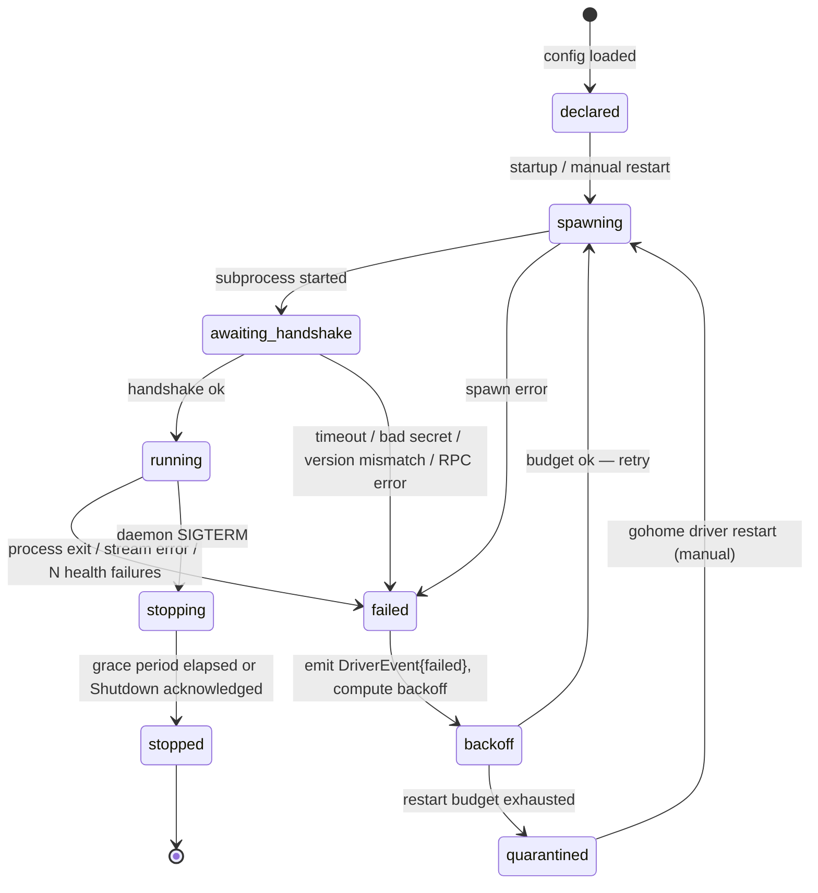

# Driver Lifecycle

!!! status-alpha "Alpha — shipped, interface evolving"

`gohomed` manages driver processes through a well-defined lifecycle state machine. Understanding the lifecycle helps you write drivers that handle reconnects correctly, diagnose quarantined instances, and design health checks that match your driver's behaviour.

---

## State machine



---

## States in detail

### `declared`

The instance exists in `drivers.toml` (or the Pkl config in C4+) but has not been started yet. This is the initial state when the daemon starts up before the driver subsystem has processed the instance.

### `spawning`

`gohomed` is launching the driver binary: allocating a Unix socket path, generating a per-launch handshake secret, and calling `exec.Cmd.Start`. If the binary cannot be found or the OS rejects the spawn, the instance transitions to `failed` immediately.

### `awaiting_handshake`

The subprocess is running. `gohomed` is dialling the Unix socket and waiting for the driver to call `Handshake`. The handshake must complete within `handshake_deadline_ms` (default 5000 ms). Failures at this stage:

- `handshake_deadline_ms` exceeded
- Wrong protocol version (must be `v1alpha1`)
- Handshake secret mismatch
- gRPC error during the handshake RPC

All produce a `DriverEvent{kind: "handshake_failed"}` and a transition to `failed`.

### `running`

The handshake succeeded. `gohomed` holds the bidi Run stream open. The driver is receiving commands and emitting state changes. `gohomed` sends a `Heartbeat.ping` every 10 seconds; the driver must echo it as `Heartbeat.pong`. Three consecutive missed pings (30 s of silence) count as a health failure.

In addition, `gohomed` performs an explicit `Health` RPC every `health_probe_interval_ms` (default 15 000 ms). If the RPC times out or returns `ok: false`, the failure count increments. `health_failures_to_restart` consecutive failures (default 3) trigger a transition to `failed`.

### `failed`

The instance has stopped working. A `DriverEvent{kind: "failed", detail: "<cause>"}` is appended to the event log. `gohomed` computes the next backoff interval and transitions to `backoff`.

### `backoff`

Waiting before the next restart attempt. Backoff is exponential: starts at `restart_backoff_initial_ms` (default 1 s), doubles on each restart, capped at `restart_backoff_max_ms` (default 60 s). If the session that just failed lasted more than 5 seconds, the backoff resets to 1 s (healthy session, transient failure).

If the number of restarts in the last `restart_budget_window_minutes` (default 10 min) exceeds `restart_budget_max` (default 10), the instance transitions to `quarantined` instead of spawning again.

### `quarantined`

The restart budget is exhausted. The instance will not be restarted automatically. A human must intervene:

```
gohome driver restart <instance-id>
```

This resets the restart budget and transitions the instance back to `spawning`.

### `stopping` / `stopped`

On daemon `SIGTERM`, `gohomed` sends a `Shutdown{grace_ms: 10000}` RPC to every running driver. The driver should flush in-flight work, close the Run stream send direction, return `ShutdownResponse{acknowledged: true}`, and exit. If the driver does not exit within `shutdown_grace_ms`:

1. `SIGTERM` is sent to the process.
2. After 3 more seconds, `SIGKILL`.

---

## State transition events

Every meaningful transition produces a `DriverEvent` in the event log with `source = "carport:host"`:

| Transition | `DriverEvent.kind` | `detail` |
|---|---|---|
| spawning → awaiting_handshake | `spawned` | PID |
| awaiting_handshake → running | `started` | manifest version |
| awaiting_handshake → failed | `handshake_failed` | reason |
| running → failed | `failed` | cause (crash / health / stream) |
| failed → backoff | `backoff_scheduled` | next attempt timestamp |
| backoff → quarantined | `quarantined` | reason |
| quarantined → spawning | `restart_manual` | actor |
| any → stopping | `stopping` | initiator |
| stopping → stopped | `stopped` | exit code |

These events are queryable via `gohome event list --source carport:host --instance <id>`.

---

## Stateless from gohomed's perspective

`gohomed` considers drivers **stateless**: every time a driver reconnects, it is treated as a fresh start. The driver's job at handshake time is to present the current state of its entities via `HandshakeResponse.initial_entities`.

On reconnect, the driver re-registers its entities from scratch with empty initial attributes. The daemon rebuilds current entity state from the event log — not from the driver. Drivers do not need to track or restore state across reconnects.

**What this means in practice:**

- The driver must not rely on any state stored in `gohomed`. It must either query the device on startup, maintain its own in-memory state, or persist state to disk.
- If the driver crashes, any in-flight command results are lost. `gohomed` appends `CommandAck{ok: false, error_message: "driver stream closed"}` for every in-flight command when the stream closes.
- The event log is the durable record. On daemon restart, `gohomed` replays the event log to rebuild the state cache and registry — driver processes are not involved in this replay.

---

## Lifecycle policy defaults

| Tunable | Default | Meaning |
|---|---|---|
| `handshake_deadline_ms` | 5000 | Max time to complete the handshake after spawn |
| `health_probe_interval_ms` | 15000 | How often the `Health` RPC is called |
| `health_probe_timeout_ms` | 3000 | How long to wait for a `Health` response |
| `health_failures_to_restart` | 3 | Consecutive health failures before restart |
| `shutdown_grace_ms` | 10000 | Grace period before SIGTERM/SIGKILL on daemon shutdown |
| `restart_backoff_initial_ms` | 1000 | First backoff interval after a failure |
| `restart_backoff_max_ms` | 60000 | Maximum backoff interval |
| `restart_budget_window_minutes` | 10 | Rolling window for restart budget |
| `restart_budget_max` | 10 | Max restarts within the window before quarantine |

All tunables are overridable per instance in `drivers.toml`'s `[instance.lifecycle]` block.
