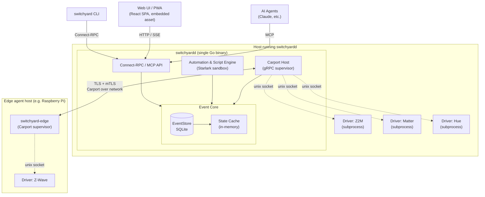

# Architecture overview

!!! status-alpha "Alpha — shipped, interface evolving"
    The component structure described here reflects the design. See the [Changelog](changelog.md) for current implementation status.

switchyard is a single-primary daemon with optional remote edge agents. This page describes the components, the binaries, the internal module boundaries, and the five public contracts that are hardest to change.

## Component diagram

All external clients — the CLI, the web UI, and AI agents — talk to a single API endpoint. Drivers are always out-of-process; they communicate over the Carport gRPC protocol. Edge agents are optional and communicate over the same Carport protocol, tunnelled over mTLS.

## Binaries

| Binary | Role | Distribution |
|---|---|---|
| `switchyardd` | The daemon. Runs all long-running logic: event store, driver manager, automation engine, Connect-RPC server, MCP server, and the embedded web UI. | Static Go binary, OCI image, `.deb`/`.rpm`, Homebrew formula |
| `switchyard` | CLI client for operators. Thin Connect-RPC client. Used for config management, driver management, diagnostics, and ad-hoc queries. | Static Go binary |
| `switchyard-edge` | Edge agent. Runs on remote hosts, hosts driver subprocesses, and forwards Carport traffic to the primary daemon over mTLS. | Static Go binary, OCI image |

All three are statically linked with no runtime dependencies. Drop them on any supported Linux host and they run.

## Internal modules

`switchyardd` is structured as a set of Go packages with narrow interfaces. Each module owns a specific responsibility and communicates with others through defined contracts rather than shared state.

| Module | Responsibility |
|---|---|
| `eventstore` | Append-only event log, snapshots, replay, and tailing. SQLite-backed. The sole gatekeeper of event data — no other module touches the events table directly. |
| `state` | In-memory materialized view over the event log. Fast reads via map lookup. Rebuilt from the nearest snapshot + replay on startup. |
| `registry` | Device, entity, area, zone, driver instance, and user registry. A SQL projection populated from registry-affecting events; rebuildable at any time. |
| `carport-host` | gRPC supervisor for local driver subprocesses and remote edge-agent connections. Manages driver lifecycle: launch, handshake, health probing, restart with backoff. |
| `carport-proto` | Protobuf-defined Carport contract (`switchyard.carport.v1alpha1`). Public and versioned. |
| `api` | Connect-RPC service implementations (`switchyard.v1.*`). Authentication and authorization enforced at every handler. |
| `mcp` | MCP server. A thin shim over the `api` layer that exposes switchyard tools to AI agents. |
| `web` | Embedded React bundle (static assets) and HTTP mux. No Node.js in production. |
| `config` | Pkl loader, validator, and diff-based reloader. Produces typed protobuf artifacts. Drives diff-based reloads: only changed driver instances or automations are re-initialized. |
| `automation` | Starlark sandbox and automation/script runtime. Handles trigger matching, condition evaluation, action dispatch, and resource enforcement (wall-clock budget, step counter, memory cap). |
| `auth` | Users, roles, sessions, passkeys, API tokens, OIDC, and policy enforcement. Policies are Pkl-declared and compiled to a policy artifact enforced at the API boundary. |
| `recorder` | Long-term retention management: WAL checkpointing, vacuum scheduling, optional TSDB sink stub. |
| `supervisord` | Main orchestrator. Wires modules together and handles startup, shutdown, and config reload sequencing. |

## Public contracts

These five surfaces are the hardest things to change once drivers, third-party tools, or user configs depend on them. They are versioned explicitly and treated with the same discipline as a public library API.

### 1. Carport protocol

The driver IPC protocol. Defined in protobuf (`switchyard.carport.v1alpha1`, graduating to `v1`). Every driver — local subprocess, edge-hosted, or future WASM — speaks this protocol. Breaking changes here require all drivers to update in lockstep.

### 2. Event schema

The protobuf messages persisted in the event log. Old events must remain readable forever; new event kinds are additive. The event schema is what makes time-travel and long-term audit possible — it cannot be changed destructively.

### 3. Connect-RPC API

The external API (`switchyard.v1.*`). Used by the CLI, web UI, third-party tools, and any client built against the generated SDKs (Go, TypeScript, Python). Versioned under `switchyard.v1`; breaking changes require a version bump.

### 4. MCP tool surface

The tools exposed to AI agents. Generated from the Connect-RPC surface plus hand-written wrappers for agent-ergonomic workflows. Tool schemas must remain stable so agents that have learned the tool surface continue to work across daemon upgrades.

### 5. Pkl module schemas

The `switchyard.*` Pkl modules that users import into their config (`switchyard.base`, `switchyard.entities`, `switchyard.automations`, etc.). Changes here affect every user's config directory. Governed by semver; switchyardd pins a minimum supported version and validates at load time with clear errors.

Everything else — internal Go package boundaries, the SQL schema used by registry projections, the in-memory state representation — can be rearranged freely without breaking external consumers.
